# MCTG-从0开始动手深度强化学习

# 引言

1. 本项目希望基于cartpole，从0开始实现强化学习算法，最终实现自行设计的强化学习交易算法MCTG，达到温故知新的目的


# 强化学习基础知识

## 强化学习概述

1. 强化学习：智能体怎么在复杂、不确定的环境中最大化奖励

2. 强化学习的组成：

   - 智能体
   - 环境

3. 强化学习的过程：智能体和环境不断交互

   - 智能体在环境中获取状态后，利用状态输出一个动作（决策）
   - 动作在环境中被执行，环境根据智能体采取大的动作输出下一个状态以及当前这个动作带来的奖励

   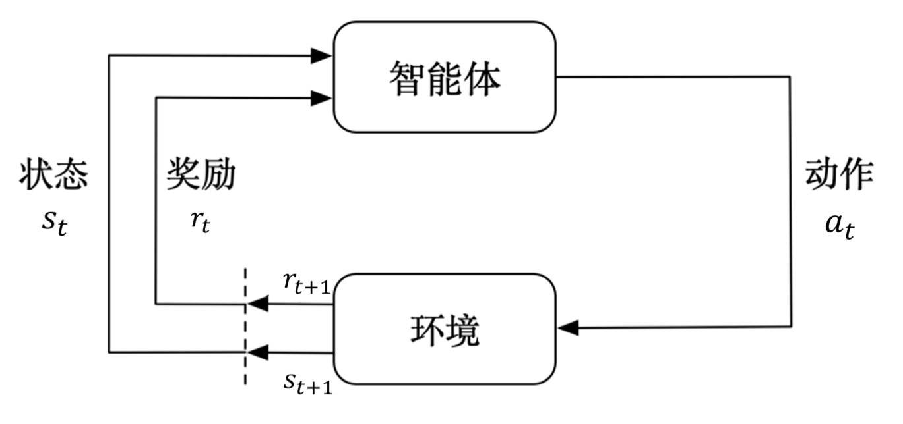

## 奖励

1. 奖励：环境给的一种标量反馈信号，这种信号可以显示智能体在某一步采取某个策略的表现如何

- 强化学习最大的目标是最大化智能体可以获得的奖励
  - 最大化期望累计奖励
- 奖励是有延迟的：不是每一动作都有奖励，每一个动作都会有长远的影响，可能要等很久才能知到某一个动作到底产生了什么影响

## 序贯决策

1. 智能体和环境：智能体会和环境进行交换，智能体将动作给环境，环境取得动作后会进行下一步，把下一步观测与这个动作带来的奖励返还给智能体，这样交互会产生很多观测，智能体的目的是从这些观测中学到最大化奖励

   - 回合：一局游戏直到游戏结束称为一个回合

   ```python
   terminated = 0
   for e in range(episodes):
     while not terminated:
       action = agent.action(state)
       next_state, reward, terminated = env.step(action)
   ```

2. 序贯决策：智能体需要采取一系列动作来最大化奖励

## 状态和观测：

1. 状态：对世界的完整描述，不会隐藏世界的信息
2. 观测：对状态的部分描述，可能会遗漏一些信息

3. 完全可观测：当智能体的状态和观测等价的时候，环境成为完全课观测
   - 这种情况下强化学习通常被建模成一个马尔科夫决策过程

4. 部分可观测：智能体只能获得部分观测，无法看到环境所有的状态
   - 部分可观测马尔科夫决策过程

## 动作空间

1. 动作空间：给定环境中，有效动作的集合
2. 离散动作空间：动作数量有限
3. 连续动作空间：动作是实值向量

## 状态空间

1. 状态空间：假设随机变量$$X_0, X_1,..., X_T$$构成一个随机过程，这个随机变量的所有可能取值的集合被称为状态空间

## 智能体

### 策略

1. 策略：智能体的动作模型，决定了智能体的动作

   - 是一个函数：把输入的状态变成动作

     ```python
     action = policy(state)
     ```

2. 策略的分类

   - 随机性策略：策略输出的是一个概率分布，根据概率采取动作
     - 具有多样性，在多个智能体博弈的时候非常重要
   - 确定性策略：策略输出一个确定的动作，通常是概率最大的动作

   

### 价值函数

1. 价值函数：对于未来奖励的预测

2. 折扣因子：衡量时间价值，未来的奖励比立即可得的奖励更廉价

3. 状态价值：对于一个状态未来奖励的预测，期望的下标 $$\pi$$ 代表策略，含义其是策略的函数，反映我们使用策略pi时到底可以获得多少奖励

   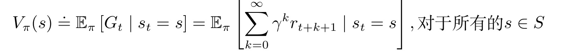

4. 状态动作价值（Q）：在某个状态下采取某个动作预期可以获得的价值

   - 未来可以获得的奖励期望取决于当前的状态和当前采取的动作

   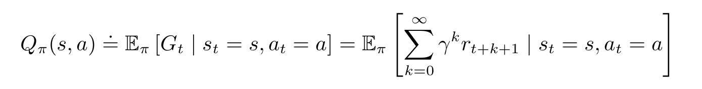


### 模型 

1. 模型：模型决定了下一步的状态，下一步的状态取决于当前的状态以及当前采取的动作

2. 模型的组成
   - 状态转移概率：$$p_{ss'}^a = p(s_{t+1}=s'|s_t = s, a_t = a)$$
   - 奖励函数：$$R(s, a) = E(r_{t+1} | s_t = s, a_t = a)$$

3. 马尔科夫决策过程：由模型、策略、价值函数组成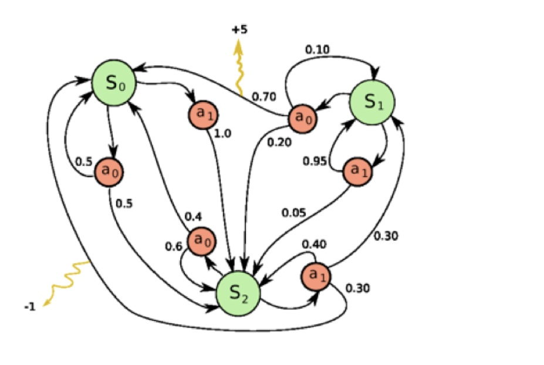

## 智能体的类型

1. 基于价值的智能体：显示学习价值函数，隐式学习策略，策略冲价值函数中进行推算
2. 基于策略的智能体：直接学习策略，给定一个状态，输出对应动作概率
3. 演员-评论家智能体：将基于价值的智能体和基于策略的智能体进行结合


## 学习和规划

1. 规划：环境已知，智能体被告知了整个环境的运作规则的详细信息，智能体能够计算出一个完美的模型，并且在不需要与环境交互就可以开始计算，也不需要实时地和未来互动就能知道未来的环境
2. 学习：当环境位置，需要在线学习获得环境信息，然后在通过规划得到一个好的解

## 探索和利用

1. 利用：当智能体在环境中进行一定的互动后能得到关于环境的部分知识，此时如果采用已知可以带来很好奖励的动作
2. 探索：通过尝试不同的动作来得到最佳策略


# 马尔科夫决策过程

## 马尔科夫过程

1. 马尔科夫性质：一个随机过程在给定现在状态及所有过去状态情况下，其未来状态的条件概率分布仅依赖于当前状态
   - 给定当前状态，将来的状态和过去的状态是条件独立的
   - 如果某一个过程满足马尔科夫过程，那么未来的转移和过去式独立的，只取决于现在
2. 马尔科夫链：一组具有马尔科夫性质的随机变量序列$$s_1,...,s_t$$，其中下一个时刻状态$$s_{t+1}$$只取决于当前状态$$s_t$$，离散时间的马尔科夫过程也称为马尔科夫链
   - 设状态的历史为$$h_t = \{s_1,...,s_t\}$$，则马尔科夫过程满足条件：$$p(s_{t+1}) = p(s_{t+1}|h_t)$$
   - 从当前的状态$$s_t$$转移到$$s_{t+1}$$直接等价于从之前的所有状态转移到$$s_{t+1}$$
   - 马尔科夫链是最简单的马尔科夫过程，其状态是有限的

## 马尔科夫奖励过程

1. 马尔科夫奖励过程：马尔科夫链加上奖励函数R
2. 奖励函数R：一个期望，表示当我们到达某一个状态的时候，可以获得多大的奖励
3. 范围（horizon）：一个回合的长度，由有限个步数决定的
4. 回报（return）：奖励的折现求和，假设有折扣$$\gamma$$、奖励序列$$r_{t+1}， r_{t+2},r_{t+3}...$$，则回报为
   - T是终止时刻
   - $$\gamma$$是折扣因子


5. 状态价值函数：对于马尔科夫奖励过程，状态价值函数被定义成回报的期望
   - 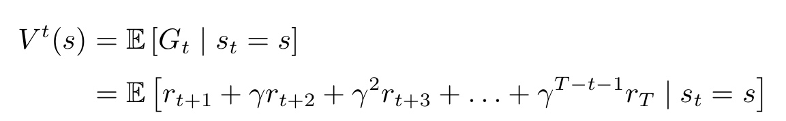
   - G是折扣回报，对折扣回报取期望

6. 贝尔曼方程
   - 从价值函数中可以推导出贝尔曼方程$$V(s) = R(s) + \gamma\sum_{s'\in S}p(s'|s)V(s')$$
   - 贝尔曼方程定义了当前状态与未来状态之间的关系

7. 蒙特卡洛奖励过程的求解：可以看到，状态的价值来自于未来回报的期望，回报的不确定性来自于状态转移，对于未知的模型（状态转移函数，奖励）应该如何计算期望呢
   - 蒙特卡洛采样：生成很多轨迹，然后取平均值，模拟出每个状态的价值
   - 动态规划
      - 解析解：适合状态空间小
      - 迭代法
   - 时序差分学习：动态规划和蒙特卡洛采样的一种结合

8. 蒙特卡洛方法：采样大量的轨迹，计算所有轨迹的真实回报，然后计算平均值

   - 方法：

     - 从某个状态开始，把小船放到状态转移矩阵里边，让它随波逐流的产生轨迹

     - 计算轨迹的折扣奖励-回报g

     - 将每个状态的回报在多条轨迹上累加起来，得到G

     - 用G除以轨迹数量得到某个状态的平均价值V

     - 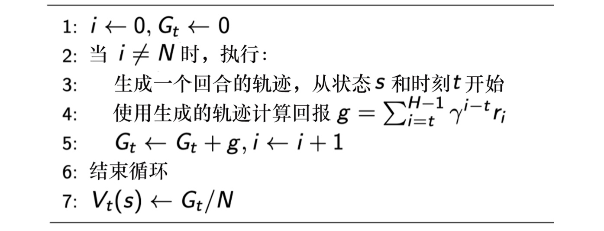

     - first_visit v.s. every visit：如果我们多次访问同一个状态，是否该每次奖励都计算？
       
       - first_visit：只计算第一次访问的时候
       - every_visit：每次访问都计算奖励
       
     - 

       ```python
       # ===== 离线统计容器 =====
       Returns = defaultdict(list)   # state -> [G1, G2, ...]
       V = defaultdict(float)        # state -> value estimate
       
       # ===== 1. 采样所有 episodes =====
       for e in range(episodes):
       
           state = env.reset()
           done = False
       
           trajectory = []   # [(state, reward), ...]
       
           # ---- 生成一条完整轨迹 ----
           while not done:
               action = agent.take_action(state)
       
               next_state, reward, terminated, truncated, _ = env.step(action)
               done = terminated or truncated
       
               trajectory.append((state, reward))
               state = next_state
       
           # ===== 2. 计算该轨迹的回报 G =====
           g = 0
           visited_states = set()   # First-Visit MC
       
           for t in reversed(range(len(trajectory))):
               state_t, reward_t = trajectory[t]
       
               g = reward_t + gamma * g
       
               # ===== 3. 离线累加回报 =====
               if state_t not in visited_states:
                   Returns[state_t].append(g)
                   visited_states.add(state_t)
       
       # ===== 4. 所有 episodes 结束后，统一计算平均价值 =====
       for state in Returns:
         	G = sum(Returns[state])
           N_traj = len(Returns[state])
           V[state] =  G / N_traj
       
       return V
       ```

   - 增量均值：

     - 如果有样本$$x_1,x_2,...,x_t$$，可以把经验均值转化为增量均值

     - 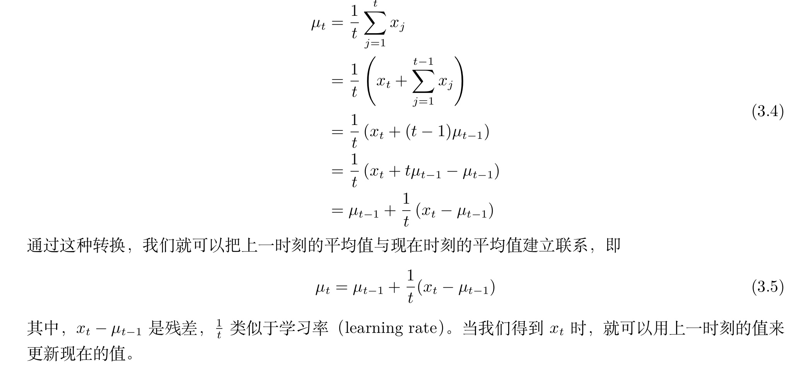

     - ```python
       # ===== 离线统计容器 =====
       Returns = defaultdict(list)   # state -> [G1, G2, ...]
       V = defaultdict(float)        # state -> value estimate
       N = defaultdict(int)        # state -> visit count
       # ===== 1. 采样所有 episodes =====
       for e in range(episodes):
       
           state = env.reset()
           done = False
       
           trajectory = []   # [(state, reward), ...]
       
           # ---- 生成一条完整轨迹 ----
           while not done:
               action = agent.take_action(state)
       
               next_state, reward, terminated, truncated, _ = env.step(action)
               done = terminated or truncated
       
               trajectory.append((state, reward))
               state = next_state
       
           # ===== 2. 计算该轨迹的回报 G =====
           g = 0
           visited_states = set()   # First-Visit MC
       
           for t in reversed(range(len(trajectory))):
               state_t, reward_t = trajectory[t]
       
               g = reward_t + gamma * g
       
               # ===== 3. 离线累加回报 =====
               if state_t not in visited_states:
                   N[state_t] += 1
       
                   # 增量均值公式
                   V[state_t] += (g - V[state_t]) / N[state_t]
       
                   visited_states.add(state_t)
       
       				# ===== 4. 计算增量均值=====
               for state in Returns:
                 V[state] +=  (g - Returns[state]) / t 
       
       return V
       ```

     - 

9. 动态规划：

   - 解析解：由于贝尔曼方程可以证明最终会收敛，因此两次迭代之间V值应当相等，可以结合状态转移函数结合贝尔曼方程写出矩阵形式求解

     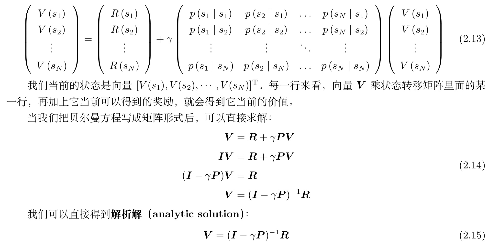

   - 迭代法：通过动态规划迭代贝尔曼方程，直到价值函数收敛

     - 由于解析解求逆在状态空间很大的情况下不可行，需要使用迭代法逐步求解
     - bootstrap自举：基于后继状态价值的估计来更新现在状态价值的估计
       - 由于是更具其他估算值来更新估算值，因此称为自举
     - 贝尔曼更新：使用bootstrap方法不断更新贝尔曼方程，当最后一个状态和上一次迭代区别不大时，停止更新

   - ```
     		V = defaultdict(lambda: float("inf"))   # V(s) ← ∞
         V_new = defaultdict(float)              # V'(s) ← 0
       
         for s in states:
             V[s] = float("inf")
             V_new[s] = 0.0
       
         # ===== 2. 迭代直到收敛 =====
         while True:
       
             # 3. V ← V'
             for s in states:
                 V[s] = V_new[s]
       
             delta = 0  # 用来计算 ||V - V'|| 
       
             # 4. Bellman 更新
             for s in states:
       
                 expected_value = 0
       
                 for s_next in states:
                     prob = P[s][s_next]
                     expected_value += prob * V[s_next]
       
                 V_new[s] = R[s] + gamma * expected_value
       
                 delta = max(delta, abs(V_new[s] - V[s]))
       
             # 2. 判断收敛
             if delta < epsilon:
                 break
       
         # 6. 返回
         return V_new
     ```


## 马尔科夫决策过程

1. 之前的概念中没有引入智能体决策，而是让智能体在环境中随波逐流，因此奖励仅仅依赖环境的不确定性
2. 马尔科夫决策过程：引入决策，同时在状态转移条件中引入动作，未来的状态不仅依赖于当前状态，也依赖于智能体采取的动作
   - 状态转移函数：$$p(s_{t+1}=s'|s_t = s,a_t = a)$$
   - 马尔科夫决策过程满足条件：$$p(s_{t+1}|s_t,a_t) = p(s_{t+1}|h_t,a_t)$$
   - 奖励函数：$$R(s_t = s,a_t = a) = E[r_t|s_t=s,a_t=a]$$

3. 马尔科夫决策过程中的策略
   - 策略：某个状态下该采取的动作
     - $$\pi(a|s) = p(a_t = a|s_t=s)$$
   - 假设策略函数平稳，不同时间点，采取的动作其实都是在对策略函数进行采样
4. 已知马尔科夫决策过程和策略pi，马尔科夫决策过程可以转换为马尔科夫奖励过程
   - 策略已知，对动作求和消去，就可以得到没有动作的马尔科夫奖励过程
     - $$P_{\pi}(s'|s) = \sum_{a\in A}\pi(a|s)p(s'|s,a)$$
   - 奖励函数同理
     - $$r_{\pi}(s) = \sum_{a\in A}\pi(a|s)r(s,a)$$
5. 马尔科夫奖励过程和决策过程的区别
   - 马尔可夫过程/马尔可夫奖励过程的状态转移是直接决定的。比如当前状态是 s，那么直接通过转移概率决定下一个状态是什么。
   - 但对于马尔可夫决策过程，它的中间多了一层动作 a ，即智能体在当前状态的时候，首先要决定采取某一种动作，这样我们会到达某一个黑色的节点。到达这个黑色的节点后，因为有一定的不确定性，所以当智能体当前状态以及智能体当前采取的动作决定过后，智能体进入未来的状态其实也是一个概率分布。
   - 在当前状态与未来状态转移过程中多了一层决策性，这是马尔可夫决策过程与之前的马尔可夫过程/马尔可夫奖励过程很不同的一点。在马尔可夫决策过程中，动作是由智能体决定的， 智能体会采取动作来决定未来的状态转移。
   - 为什么选了a不会进入一个确定的状态：超级玛丽向前走的时候，环境中的障碍也在变化，因此最终得到的状态也是不确定的，状态是有环境和智能体的行动共同决定的
   - 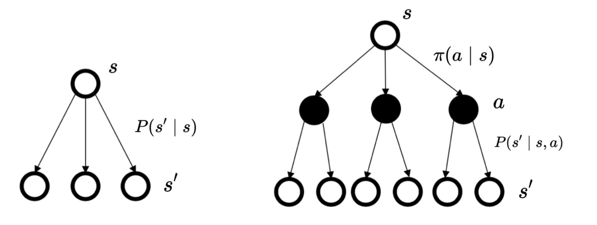


6. 状态动作价值函数-Q函数：在某个状态采取某个动作能得到的期望回报

   - 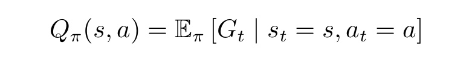

   - 由于这里的期望也是基于策略的，通过对策略函数进行一个加和，就可以得到他的价值
   - 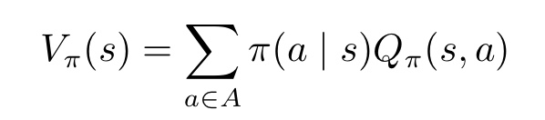

   - 另外从Q函数中可以推导出其贝尔曼方程
   - 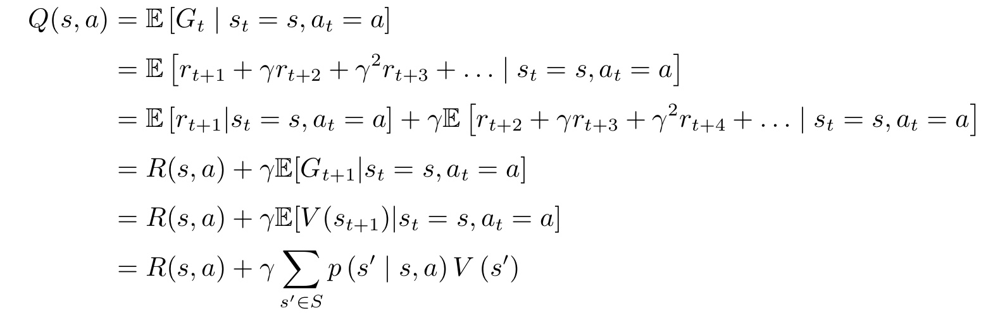

7. 贝尔曼期望方程：定义了当前状态和未来状态之间的关联

8. 策略评估：在马尔科夫奖励过程中，为了计算值，采用了随波逐流的方式。在策略评估中，智能体会进行决策

   - 通过反复迭代同样可以获得状态价值

9. 预测和控制

   - 预测：输入马尔科夫决策过程$$<S,A,P,R,\gamma>$$，和策略$$\pi$$，输出价值函数$$V_\pi$$
     - 计算每个状态的价值
   - 控制：输入马尔科夫决策过程$$<S,A,P,R,\gamma>$$输入出最佳价值函数$$V*$$和最佳策略$$\pi*$$
     - 寻找一个最佳策略，然后输出最佳价值函数和最佳策略
   - 预测和控制是递进关系，先解决预测问题然后解决控制问题

10. 马尔科夫决策过程控制

    - 通过策略评估和马尔科夫决策过程，我们可以估算出价值函数的值

    - 如果只有马尔科夫决策过程，如何找出最佳策略？

    - 最佳价值函数：$$V*(s) = \underset{\pi}{max}V_{\pi}(s)$$

      - 搜索一种策略pi让每个状态价值最大，$$V^*$$就是达到每一个状态，价值最大的情况
      - $$\pi^*(s) = \underset{\pi}{argmax}= V_{\pi}(s)$$

    - 获得最佳价值函数之后，可以通过对Q函数最大化来得到最佳策略

      - 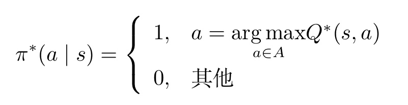

      - 如果能优化出Q函数$$Q*(s,a)$$，就可以直接在Q函数中提取处让Q函数最大化的动作，从而提取处最佳策略

11. 获得一个最佳策略

    - 对于一个实现定好的马尔科夫决策过程，当智能体采取最佳策略的时候，最佳策略一般是确定而且平稳的，但不一定是唯一的
    - 获得最佳策略的方法
      - 穷举
      - 策略迭代
      - 价值迭代

12. 策略迭代：两个步骤迭代进行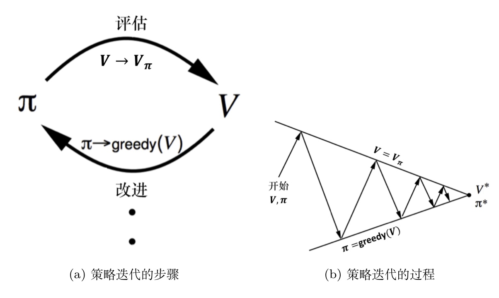

    - 策略评估：当优化策略pi时，先保证策略pi不变，然后估计他的价值
    - 策略改进：得到状态价值函数后，可以进一步推算出它的Q函数，得到Q函数后直接对Q函数进行最大化，通过贪心搜索来进一步改进策略
      - 得到状态价值函数后，可以通过奖励函数以及状态转移函数来计算Q函数
        - $$Q_{\pi_i}(s,a) = R(s,a)+\gamma\sum_{s\in S}{p(s|s,a)V_{\pi_i}(s')}$$
      - 对每个状态，策略改进会得到新一轮策略，对每个状态，取使它得到最大值的动作
      - 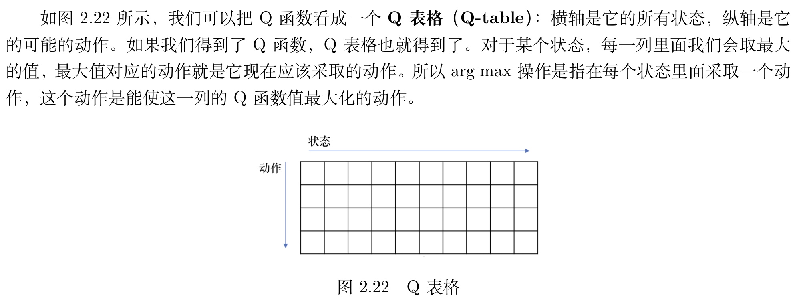

13. 价值迭代：

    - 最优性原理：当且仅当所有子问题最优，原问题最优
    - 迭代贝尔曼最优方程，使价值函数迭代为最佳价值函数
      - 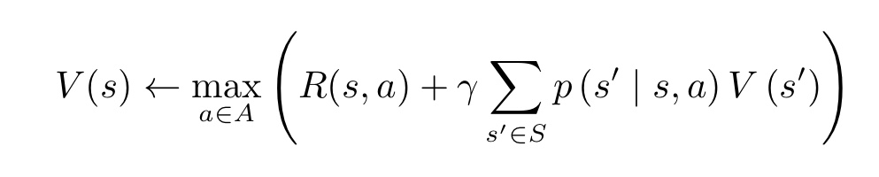
    - 价值迭代的工作类似于反向传播，在一个轨迹中，获得奖励，并将奖励传播到每一个位置，最终在推理的时候作为依据


# Policy Gradient

## Reinforce

