# MCTG-从0开始动手深度强化学习

# 引言

1. 本项目希望基于cartpole，从0开始实现强化学习算法，最终实现自行设计的强化学习交易算法MCTG，达到温故知新的目的


# 强化学习基础知识

## 强化学习概述

1. 强化学习：智能体怎么在复杂、不确定的环境中最大化奖励

2. 强化学习的组成：

   - 智能体
   - 环境

3. 强化学习的过程：智能体和环境不断交互

   - 智能体在环境中获取状态后，利用状态输出一个动作（决策）
   - 动作在环境中被执行，环境根据智能体采取大的动作输出下一个状态以及当前这个动作带来的奖励

   

## 奖励

1. 奖励：环境给的一种标量反馈信号，这种信号可以显示智能体在某一步采取某个策略的表现如何

- 强化学习最大的目标是最大化智能体可以获得的奖励
  - 最大化期望累计奖励
- 奖励是有延迟的：不是每一动作都有奖励，每一个动作都会有长远的影响，可能要等很久才能知到某一个动作到底产生了什么影响

## 序贯决策

1. 智能体和环境：智能体会和环境进行交换，智能体将动作给环境，环境取得动作后会进行下一步，把下一步观测与这个动作带来的奖励返还给智能体，这样交互会产生很多观测，智能体的目的是从这些观测中学到最大化奖励

   - 回合：一局游戏直到游戏结束称为一个回合

   ```python
   terminated = 0
   for e in range(episodes):
     while not terminated:
       action = agent.action(state)
       next_state, reward, terminated = env.step(action)
   ```

2. 序贯决策：智能体需要采取一系列动作来最大化奖励

## 状态和观测：

1. 状态：对世界的完整描述，不会隐藏世界的信息
2. 观测：对状态的部分描述，可能会遗漏一些信息

3. 完全可观测：当智能体的状态和观测等价的时候，环境成为完全课观测
   - 这种情况下强化学习通常被建模成一个马尔科夫决策过程

4. 部分可观测：智能体只能获得部分观测，无法看到环境所有的状态
   - 部分可观测马尔科夫决策过程

## 动作空间

1. 动作空间：给定环境中，有效动作的集合
2. 离散动作空间：动作数量有限
3. 连续动作空间：动作是实值向量

## 状态空间

1. 状态空间：假设随机变量$X_0, X_1,..., X_T$构成一个随机过程，这个随机变量的所有可能取值的集合被称为状态空间

## 智能体

### 策略

1. 策略：智能体的动作模型，决定了智能体的动作

   - 是一个函数：把输入的状态变成动作

     ```python
     action = policy(state)
     ```

2. 策略的分类

   - 随机性策略：策略输出的是一个概率分布，根据概率采取动作
     - 具有多样性，在多个智能体博弈的时候非常重要
   - 确定性策略：策略输出一个确定的动作，通常是概率最大的动作

   

### 价值函数

1. 价值函数：对于未来奖励的预测

2. 折扣因子：衡量时间价值，未来的奖励比立即可得的奖励更廉价

3. 状态价值：对于一个状态未来奖励的预测，期望的下标 $$\pi$$ 代表策略，含义其是策略的函数，反映我们使用策略pi时到底可以获得多少奖励

   

4. 状态动作价值（Q）：在某个状态下采取某个动作预期可以获得的价值

   - 未来可以获得的奖励期望取决于当前的状态和当前采取的动作

   


### 模型 

1. 模型：模型决定了下一步的状态，下一步的状态取决于当前的状态以及当前采取的动作

2. 模型的组成
   - 状态转移概率：$$p_{ss'}^a = p(s_{t+1}=s'|s_t = s, a_t = a)$$
   - 奖励函数：$$R(s, a) = E(r_{t+1} | s_t = s, a_t = a)$$

3. 马尔科夫决策过程：由模型、策略、价值函数组成

## 智能体的类型

1. 基于价值的智能体：显示学习价值函数，隐式学习策略，策略冲价值函数中进行推算
2. 基于策略的智能体：直接学习策略，给定一个状态，输出对应动作概率
3. 演员-评论家智能体：将基于价值的智能体和基于策略的智能体进行结合


## 学习和规划

1. 规划：环境已知，智能体被告知了整个环境的运作规则的详细信息，智能体能够计算出一个完美的模型，并且在不需要与环境交互就可以开始计算，也不需要实时地和未来互动就能知道未来的环境
2. 学习：当环境位置，需要在线学习获得环境信息，然后在通过规划得到一个好的解

## 探索和利用

1. 利用：当智能体在环境中进行一定的互动后能得到关于环境的部分知识，此时如果采用已知可以带来很好奖励的动作
2. 探索：通过尝试不同的动作来得到最佳策略


# 马尔科夫决策过程

## 马尔科夫过程

1. 马尔科夫性质：一个随机过程在给定现在状态及所有过去状态情况下，其未来状态的条件概率分布仅依赖于当前状态
   - 给定当前状态，将来的状态和过去的状态是条件独立的
   - 如果某一个过程满足马尔科夫过程，那么未来的转移和过去式独立的，只取决于现在
2. 马尔科夫链：一组具有马尔科夫性质的随机变量序列$s_1,...,s_t$，其中下一个时刻状态$s_{t+1}$只取决于当前状态$s_t$，离散时间的马尔科夫过程也称为马尔科夫链
   - 设状态的历史为$h_t = \{s_1,...,s_t\}$，则马尔科夫过程满足条件：$p(s_{t+1}) = p(s_{t+1}|h_t)$
   - 从当前的状态$$s_t$$转移到$$s_{t+1}$$直接等价于从之前的所有状态转移到$s_{t+1}$
   - 马尔科夫链是最简单的马尔科夫过程，其状态是有限的

## 马尔科夫奖励过程

1. 马尔科夫奖励过程：马尔科夫链加上奖励函数R
2. 奖励函数R：一个期望，表示当我们到达某一个状态的时候，可以获得多大的奖励
3. 范围（horizon）：一个回合的长度，由有限个步数决定的
4. 回报（return）：奖励的折现求和，假设有折扣$\gamma$、奖励序列$r_{t+1}， r_{t+2},r_{t+3}...$，则回报为
   - T是终止时刻
   - $\gamma$是折扣因子


5. 状态价值函数：对于马尔科夫奖励过程，状态价值函数被定义成回报的期望
   - 
   - G是折扣回报，对折扣回报取期望

6. 贝尔曼方程
   - 从价值函数中可以推导出贝尔曼方程$V(s) = R(s) + \gamma\sum_{s'\in S}p(s'|s)V(s')$
   - 贝尔曼方程定义了当前状态与未来状态之间的关系

7. 蒙特卡洛奖励过程的求解：可以看到，状态的价值来自于未来回报的期望，回报的不确定性来自于状态转移，对于未知的模型（状态转移函数，奖励）应该如何计算期望呢
   - 蒙特卡洛采样：生成很多轨迹，然后取平均值，模拟出每个状态的价值
      - 有无模型都适用
      - 每次可以更新一个轨迹的状态
      - 需要游戏有终止状态
      - 不要求马尔科夫环境
      - V高方差，低偏差：使用整个轨迹，累积了很多步地噪声和随机性，导致方差大，但由于是全局的采样，因此理论上是无偏的
      - 蒙特卡洛通过多次统计，直接估计出每一个状态的可能价值
   - 动态规划
      - 解析解：适合状态空间小
      - 迭代法
      - 有模型的方法
      - 每次要更新所有状态
   - 时序差分学习：动态规划和蒙特卡洛采样的一种结合
      - 免模型
      - 不要求游戏有终止，可以在线学习
      - 假设环境由马尔科夫性质，在马尔科夫环境下有更高的学习效率
      - V低方差，高偏差：使用了自举，随机性来自于下一步的奖励和下一个状态，因此每次更新方差更小，但是由于是自举（用的估计值），是有偏的
      - 时序差分用一种类似反向传播的方法，将最终奖励的价值通过多个回合逐渐传播到每一个状态
   
8. 蒙特卡洛方法：采样大量的轨迹，计算所有轨迹的真实回报，然后计算平均值

   - 方法：

     - 从某个状态开始，把小船放到状态转移矩阵里边，让它随波逐流的产生轨迹

     - 计算轨迹的折扣奖励-回报g

     - 将每个状态的回报在多条轨迹上累加起来，得到G

     - 用G除以轨迹数量得到某个状态的平均价值V

     - 

     - first_visit v.s. every visit：如果我们多次访问同一个状态，是否该每次奖励都计算？
       
       - every_visit：每次访问都计算奖励
         - 问题：连续用高度相关的G更新，数值可能会抖动的很厉害
       - first_visit：只计算第一次访问的时候记入returns
       
     - 

       ```python
       # ===== 离线统计容器 =====
       Returns = defaultdict(list)   # state -> [G1, G2, ...]
       V = defaultdict(float)        # state -> value estimate
       
       # ===== 1. 采样所有 episodes =====
       for e in range(episodes):
       
           state = env.reset()
           done = False
       
           trajectory = []   # [(state, reward), ...]
       
           # ---- 生成一条完整轨迹 ----
           while not done:
               action = agent.take_action(state)
       
               next_state, reward, terminated, truncated, _ = env.step(action)
               done = terminated or truncated
       
               trajectory.append((state, reward))
               state = next_state
       
           # ===== 2. 计算该轨迹的回报 G =====
           g = 0
           visited_states = set()   # First-Visit MC
       
           for t in reversed(range(len(trajectory))):
               state_t, reward_t = trajectory[t]
       
               g = reward_t + gamma * g
       
               # ===== 3. 离线累加回报 =====
               if state_t not in visited_states:
                   Returns[state_t].append(g)
                   visited_states.add(state_t)
       
       # ===== 4. 所有 episodes 结束后，统一计算平均价值 =====
       for state in Returns:
         	G = sum(Returns[state])
           N_traj = len(Returns[state])
           V[state] =  G / N_traj
       
       return V
       ```

   - 增量均值：

     - 如果有样本$$x_1,x_2,...,x_t$$，可以把经验均值转化为增量均值

     - 

     - 简单的可以令$\alpha = 1/t$，alpha可以认为是学习率
       
       ```python
       # ===== 离线统计容器 =====
       Returns = defaultdict(list)   # state -> [G1, G2, ...]
       V = defaultdict(float)        # state -> value estimate
       N = defaultdict(int)        # state -> visit count
       # ===== 1. 采样所有 episodes =====
       for e in range(episodes):
       
           state = env.reset()
           done = False
       
           trajectory = []   # [(state, reward), ...]
       
           # ---- 生成一条完整轨迹 ----
           while not done:
               action = agent.take_action(state)
       
               next_state, reward, terminated, truncated, _ = env.step(action)
               done = terminated or truncated
       
               trajectory.append((state, reward))
               state = next_state
       
           # ===== 2. 计算该轨迹的回报 G =====
           g = 0
           visited_states = set()   # First-Visit MC
       
           for t in reversed(range(len(trajectory))):
               state_t, reward_t = trajectory[t]
       
               g = reward_t + gamma * g
       
               # ===== 3. 离线累加回报 =====
               if state_t not in visited_states:
                   N[state_t] += 1
       
                   # 增量均值公式
                   V[state_t] += (g - V[state_t]) / N[state_t]
       
                   visited_states.add(state_t)
       
       				# ===== 4. 计算增量均值=====
               for state in Returns:
                 V[state] +=  (g - Returns[state]) / t 
       
       return V
       ```
       
     - 

9. 动态规划：

   - 解析解：由于贝尔曼方程可以证明最终会收敛，因此两次迭代之间V值应当相等，可以结合状态转移函数结合贝尔曼方程写出矩阵形式求解

     

   - 迭代法：通过动态规划迭代贝尔曼方程，直到价值函数收敛

     - 由于解析解求逆在状态空间很大的情况下不可行，需要使用迭代法逐步求解
     - bootstrap自举：基于后继状态价值的估计来更新现在状态价值的估计
       - 由于是更具其他估算值来更新估算值，因此称为自举
     - 贝尔曼更新：使用bootstrap方法不断更新贝尔曼方程，当最后一个状态和上一次迭代区别不大时，停止更新
     - 
   
   - ```
     	V = defaultdict(lambda: float("inf"))   # V(s) ← ∞
      V_new = defaultdict(float)              # V'(s) ← 0
      
      for s in states:
         V[s] = float("inf")
         V_new[s] = 0.0
      
      # ===== 2. 迭代直到收敛 =====
      while True:
      
         # 3. V ← V'
         for s in states:
             V[s] = V_new[s]
      
         delta = 0  # 用来计算 ||V - V'|| 
      
         # 4. Bellman 更新
         for s in states:
      
             expected_value = 0
      
             for s_next in states:
                 prob = P[s][s_next]
                 expected_value += prob * V[s_next]
      
             V_new[s] = R[s] + gamma * expected_value
      
             delta = max(delta, abs(V_new[s] - V[s]))
      
         # 2. 判断收敛
         if delta < epsilon:
             break
      
      # 6. 返回
      return V_new
     ```

10. 时序差分学习（Temporal Difference）

    - 目的：对于某个给定的策略$$\pi$$，在线地计算出它的价值函数$$V_\pi$$，即一步一步地算

      - 在线学习：可以在游戏中边玩边更新
      - 离线学习：要等游戏结束后才能进行更新

    - 最简单的算法是一步时序差分$TD(0)$

      - 每往前走一步，就做一步自举，用得到的估计回报$r_{t+1}+\gamma V(s_{t+1})$，来更新上一时刻的值$V(s_t)$：
      -  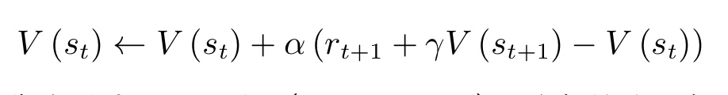

      - 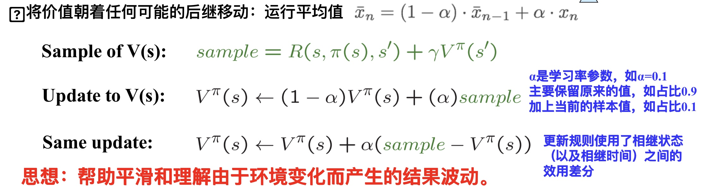

    - 时序差分目标（TD Target）：估计回报$r_{t+1}+\gamma V(s_{t+1})$

      - 时序差分目标是带衰减的未来奖励的总和

    - 时序差分目标由两部分组成

      - 走了某一步后的实际奖励                                                                                          
      - 利用自举方法，通过之前的估计来估计的$V(s_{t+1})$，并且加了折扣因子，即$\gamma V(s_{t+1})$

    - 时序差分目标是估计有两个原因

      - 时序差分法对期望值进行采样
      - 时序差分方法使用当前估计的V而不是真实的$V_ \pi$

    - （TD error）时序差分误差：$\delta = r_{t+1}+\gamma V(s_{t+1}-V(s_t))$，类比增量式蒙特卡洛方法，给定一个回合i，可以更新$V(s_t)$来逼近真实的回报$G_t$，具体公式为：

      - $$V(s_t)\leftarrow V(s_t)+\alpha(G_{i,t}-V(s_t))$$

    - 对比时序差分学习和蒙特卡洛模拟

      - 在蒙特卡洛方法里面，$Gi,t$是实际得到的值（可以看成目标），因为它已经把一条轨迹跑完了，可以算出每个状态实际的回报
      - 时序差分不等轨迹结束，往前走一步，就可以更新价值函数。
      - 时序差分方法只执行一步，状态的值就更新。蒙特卡洛方法 全部执行完之后，到了终止状态之后，再更新它的值

    - n步时序差分

      - 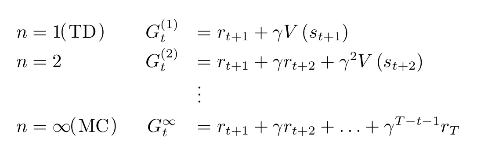

      - TD(2)：往前走两步，利用两步得到的回报，使用自举来更新状态
      - TD(n)
        - 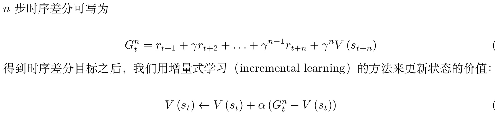
      - TD(inf)：等游戏结束后更新，即蒙特卡洛方法

## 马尔科夫决策过程（MDP）

1. 之前的概念中没有引入智能体决策，而是让智能体在环境中随波逐流，因此奖励仅仅依赖环境的不确定性
2. 马尔科夫决策过程：马尔科夫决策过程由一下部分定义
   - 一组状态$s\in S$
   - 一组动作$a\in A$
   - 一个转移函数/模型$P(s'|s,a)$
   - 一个奖励函数R(s,a,s')
   - 一个起始状态$s_0$
   - 折扣因子$\gamma$
3. 马尔科夫决策过程相比于奖励过程引入决策，同时在状态转移条件中引入动作，未来的状态不仅依赖于当前状态，也依赖于智能体采取的动作
   - 状态转移函数：
     - $$p(s_{t+1}=s'|s_t = s,a_t = a)$$
   - 马尔科夫决策过程满足条件：
     - $$p(s_{t+1}|s_t,a_t) = p(s_{t+1}|h_t,a_t)$$
   - 奖励函数：
     - $$R(s_t = s,a_t = a) = E[r_t|s_t=s,a_t=a]$$
4. 马尔科夫决策过程中的策略
   - 策略：某个状态下该采取的动作
     - $$\pi(a|s) = p(a_t = a|s_t=s)$$
   - 假设策略函数平稳，不同时间点，采取的动作其实都是在对策略函数进行采样
5. 已知马尔科夫决策过程和策略pi，马尔科夫决策过程可以转换为马尔科夫奖励过程
   - 策略已知，对动作求和消去，就可以得到没有动作的马尔科夫奖励过程
     - $$P_{\pi}(s'|s) = \sum_{a\in A}\pi(a|s)p(s'|s,a)$$
   - 奖励函数同理
     - $$r_{\pi}(s) = \sum_{a\in A}\pi(a|s)r(s,a)$$
6. 马尔科夫奖励过程和决策过程的区别
   - 马尔可夫过程/马尔可夫奖励过程的状态转移是直接决定的。比如当前状态是 s，那么直接通过转移概率决定下一个状态是什么。
   - 但对于马尔可夫决策过程，它的中间多了一层动作 a ，即智能体在当前状态的时候，首先要决定采取某一种动作，这样我们会到达某一个黑色的节点。到达这个黑色的节点后，因为有一定的不确定性，所以当智能体当前状态以及智能体当前采取的动作决定过后，智能体进入未来的状态其实也是一个概率分布。
   - 在当前状态与未来状态转移过程中多了一层决策性，这是马尔可夫决策过程与之前的马尔可夫过程/马尔可夫奖励过程很不同的一点。在马尔可夫决策过程中，动作是由智能体决定的， 智能体会采取动作来决定未来的状态转移。
   - 为什么选了a不会进入一个确定的状态：超级玛丽向前走的时候，环境中的障碍也在变化，因此最终得到的状态也是不确定的，状态是有环境和智能体的行动共同决定的
   - 


6. 状态动作价值函数-Q函数：在某个状态采取某个动作能得到的期望回报

   - 

   - 由于这里的期望也是基于策略的，通过对策略函数进行一个加和，就可以得到他的价值
   - 

   - 另外从Q函数中可以推导出其贝尔曼方程
   - 

7. 贝尔曼期望方程：定义了当前状态和未来状态之间的关联

8. 策略评估：在马尔科夫奖励过程中，为了计算值，采用了随波逐流的方式。在策略评估中，智能体会进行决策

   - 通过反复迭代同样可以获得状态价值

9. 预测和控制

   - 预测：输入马尔科夫决策过程$$<S,A,P,R,\gamma>$$，和策略$$\pi$$，输出价值函数$$V_\pi$$
     - 计算每个状态的价值
   - 控制：输入马尔科夫决策过程$$<S,A,P,R,\gamma>$$输入出最佳价值函数$$V*$$和最佳策略$$\pi*$$
     - 寻找一个最佳策略，然后输出最佳价值函数和最佳策略
   - 预测和控制是递进关系，先解决预测问题然后解决控制问题

10. 马尔科夫决策过程控制

    - 通过策略评估和马尔科夫决策过程，我们可以估算出价值函数的值

    - 如果只有马尔科夫决策过程，如何找出最佳策略？

    - 最佳价值函数：
- $$V*(s) = \underset{\pi}{max}V_{\pi}(s)$$
      - 搜索一种策略pi让每个状态价值最大，$$V^*$$就是达到每一个状态，价值最大的情况
      - $$\pi^*(s) = \underset{\pi}{argmax}= V_{\pi}(s)$$

    - 获得最佳价值函数之后，可以通过对Q函数最大化来得到最佳策略

      - 

      - 如果能优化出Q函数$$Q*(s,a)$$，就可以直接在Q函数中提取处让Q函数最大化的动作，从而提取处最佳策略

11. 获得一个最佳策略

    - 对于一个实现定好的马尔科夫决策过程，当智能体采取最佳策略的时候，最佳策略一般是确定而且平稳的，但不一定是唯一的
    - 获得最佳策略的方法
      - 穷举
      - 策略迭代
      - 价值迭代

12. 策略迭代：两个步骤迭代进行

    - 策略评估：当优化策略pi时，先保证策略pi不变，然后估计他的价值
      - 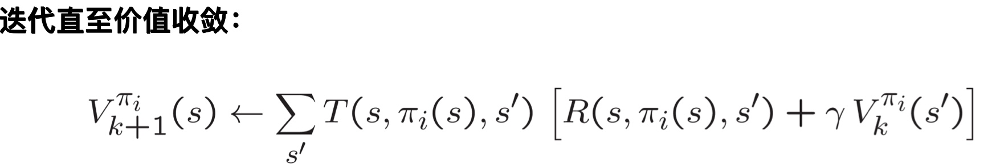
    - 策略改进：得到状态价值函数后，可以进一步推算出它的Q函数，得到Q函数后直接对Q函数进行最大化，通过贪心搜索来进一步改进策略
      - 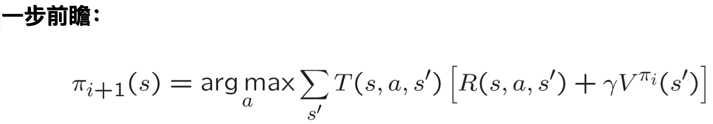
      - 得到状态价值函数后，可以通过奖励函数以及状态转移函数来计算Q函数
        - $$Q_{\pi_i}(s,a) = R(s,a)+\gamma\sum_{s\in S}{p(s|s,a)V_{\pi_i}(s')}$$
      - 对每个状态，策略改进会得到新一轮策略，对每个状态，取使它得到最大值的动作
      - 

13. 价值迭代：

    - 最优性原理：当且仅当所有子问题最优，原问题最优
    - 迭代贝尔曼最优方程，使价值函数迭代为最佳价值函数
      - 
    - 价值迭代的工作类似于反向传播，在一个轨迹中，获得奖励，并将奖励传播到每一个位置，最终在推理的时候作为依据

    


# 表格型方法

1. 表格型策略：策略最简单的表示是查表

2. 使用查找表的强化学习方法称为表格型方法

   - 如蒙特卡洛、Q学习和Sarsa
   - 记录所有状态和所有动作的Q值，然后遇到对应状态查自己该执行的动作

3. Q表格：一张状态-动作的表格

   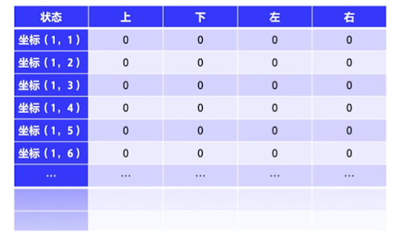

   

4. 同策略与异策略

   - 策略：输入状态，给出动作

     - 行为策略：在探索环境（choose_action函数）中使用的策略
       - 输入state，argmaxQ值的a
       - epsilon贪婪：输入state，随机产生一个a

     - 目标策略：实际要学习（update函数）的策略
       - update中时序差分下一步要用到的a
         - 可以是argmaxQ值的a
         - 也可以是行为策略实际生成的a


     - 同策略：优化的目标策略就是实际执行的行为策略
    
       - 优化Q表格时，使用下一步实际将要执行的动作来优化Q表格，update的$a_{t+1}$必须是choose_action产生的下一步真正要优化的$a_{t+1}$
    
       - 由于优化的策略是实际执行的策略，因此模型会考虑到不确定性，偏保守


   - 异策略：行为策略可以大胆探索所有可能轨迹，采集数据交给目标策略学习，

     - 由于update的策略和choose_action采取的策略不必一致，给目标策略时不需要$a_{t+1}$，
       - 目标策略优化的时候，Q学习不会管$a_{t+1}$是什么，而是只选取奖励最大的策略
     


## 悬崖寻路

1. 介绍：悬崖寻路是一个迷宫类问题，在一个网格世界中，左下角为起点，右下角为终点，目标是移动智能体到达终点位置，智能体每次可以上下左右在4个方向中选择一个，每移动一步就会得到-1单位的奖励。起终点之间是一段悬崖,即编号为37~46的网格,智能体移动过程中会有如下的限制:

   - 智能体不能移出网格,如果智能体想执行某个动作移出网格,那么这一步智能体不会移动,但是
     这个操作依然会得到-1W单位的奖励;
   - 如果智能体"掉入悬崖",会立即回到起点位置,并得到-100单位的奖励
   - 当智能体移动到终点时,该回合结束,该回合总奖励为各步类奖励之和
   - 我们的目标是以最少的步数到达终点,容易看出最少需要133步智能体才能从起点到终点,因此最佳算法收敛的情况下,每回合的总奖励应该是-13,这样人工分析出期望的奖励也便于我们判断算法的收敛情况从而做出相应调整。

    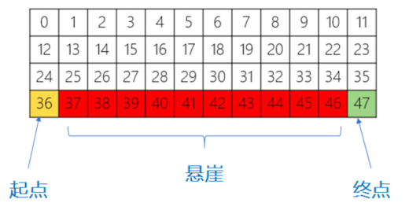

2. 现在我们可以在代码中定义环境,如下:

   ```python
   import gym
   import numpy as np
   from config import Config as cfg
   from tqdm import tqdm
   import matplotlib.pyplot as plt
   from collections import defaultdict
   import random
   import pygame
   import math
   
   env = gym.make("CliffWalking-v0")
   n_states = env.observation_space.n
   n_action = env.action_space.n
   
   print(n_states)
   print(n_action)
   
   state, _ = env.reset()
   print(state)
   ```

3. 强化学习的基本思路如下，我们将在这个基础上针对不同算法做一些修改

   - 初始化环境和智能体;
   - 对于每个回合,智能体选择动作;
   - 环境接收动作并反馈下一个状态和奖励;
   - 智能体进行策略更新(学习);
   - 多个回合之后算法收敛保存模型以及做后续的分析、画图等。
   - 可以看到智能体的基本方法是choose_action和update

4. 基本参数

   ```python
   from dataclasses import dataclass
   @dataclass
   class Config:
       env_name: str = 'CliffWalking-v0'
       gamma: float = 0.9
       alpha: float = 0.1
       epsilon: float = 0.1
       n_episodes: int = 500
       epsilon_decay: int = 1000
   ```
   
   

## Sarsa：同策略时序差分控制

1. Sarsa是一种同策略时序差分控制，我们每次使用下一步将要执行的动作的Q值$Q(s_{t+1},a_{t+1})$了来更新当前

2. 时序差分的目标是

   - $r_{t+1}+\gamma Q(s_{t+1},a_{t+1})$

   - ```python
     target = reward + self.gamma * self.Q_table[next_state][next_action]
     ```

3. Sarsa的更新方法：时序差分更新Q

   - alpha代表学习率
   - gamma代表折扣因子
   - Q增量学习形式：

   - 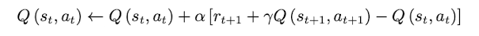
   - 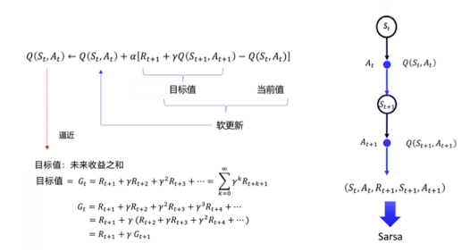****

3. 初始化Q表格：可以随机初始化或者初始化为0，因为一开始我们并没有任何信息

   - 最终Q表格将不断逼近真实的Q值

4. 更新算法的输入：当前状态(state)、当前动作(action)、奖励(reward)、下一步状态(state)、下一步动作(action)、done，取头字母得到SARSA算法命名

   - 根据时序差分，我们可以推得n步Sarsa，具体参考easy RL原书

5. 动作选择： sarsa是一种同策略的学习，所以在训练时也要考虑探索，不能总是选最优动作，否则可能会陷入局部最优，无法发现更好的策略，我们加入epsilon贪心

   - epsilon的概率我们选择随机走一步
   - 否则我们选择Q值最大的动作

6. epsilon衰减：

   - 也由于是同策略sarsa，同时epsilon带来了不确定性（脚滑随机选择动作），在优化策略的时会尽量离悬崖远一点，保证即是有随机性也不掉下去，所以训练出来的模型总是奖励稍小，但更稳健，不会总是走悬崖边死了

   - 为了解决这个问题，epsilon最好是递减的，最终不再探索。如果是常数，走悬崖边老是滑死了，模型就不敢靠边走了

7. 代码实现

   ```python
   class SARSA():
       def __init__(self, cfg, n_action, n_states):
           self.gamma = cfg.gamma
           self.alpha = cfg.alpha
           self.epsilon_start = cfg.epsilon
           self.epsilon_end = 0
           self.action_space = n_action
           self.observation_space = n_states
           self.epsilon_decay = cfg.epsilon_decay
           self.sample_count = 0
           
           # 初始化Q表
           self.Q_table = defaultdict(lambda: np.zeros(self.action_space))
   
       # ε-贪心策略
       def choose_action(self, state, train=True):
           if not train:
               return np.argmax(self.Q_table[state])
           self.sample_count += 1
           self.epsilon = self.epsilon_end + (self.epsilon_start - self.epsilon_end) * \
           math.exp(-1. * self.sample_count / self.epsilon_decay)
           # self.epsilon = self.epsilon_start # 无法收敛到最优奖励
   
           
           if random.uniform(0, 1) < self.epsilon:
               action = random.randint(0, self.action_space - 1)
           else:
               action = np.argmax(self.Q_table[state])
           return action
   
       # SARSA 更新 
       # SARSA是同策略的，因此这里需要保证下一步动作是根据当前策略选择的，所以在update函数中需要传入下一步动作next_action
       # self_sarsa错误的地方就在于下一步动作没有绑定,选择了贪心，这实际上跟像是Q-Learning
       # 而贪心意味着，由于e贪心的随机性的存在，策略最终执行的动作不一定是选择的argmax
       def update(self, state, action, reward, next_state, next_action, done):
           predict = self.Q_table[state][action]
           
           if done:
               target = reward
           else:
               target = reward + self.gamma * self.Q_table[next_state][next_action]
           
           self.Q_table[state][action] += self.alpha * (target - predict)
   agent = SARSA(cfg, n_action, n_states)
   
   ```

8. 进一步补全训练和测试代码

   ```python
   reward_history = []
   ma_reward_history = [0]
   
   for episode in tqdm(range(cfg.n_episodes), desc="Training Episodes"):
       
       state, _ = env.reset()
       action = agent.choose_action(state)   # 先选第一个动作
       ep_reward = 0
   
       while True:
           next_state, reward, terminated, truncated, _ = env.step(action)
           done = terminated or truncated
           
           next_action = agent.choose_action(next_state)  # 下一步真实动作
           
           agent.update(state, action, reward, next_state, next_action, done)
           
           state = next_state
           action = next_action  # 关键：动作向前滚动
           
           ep_reward += reward
           
           if done:
               break
   
       reward_history.append(ep_reward)
       
       ma_reward_history.append(
           0.9 * ma_reward_history[-1] + 0.1 * ep_reward
       )
       
   # 推理模式
   state, _ = env.reset()
   ep_reward = 0
   trajectory = []
   
   
   while True:
       action = agent.choose_action(state, train = False)
       next_state, reward, terminated, truncated, _ = env.step(action)
       done = terminated or truncated
   
       trajectory.append((state, action, reward))
       state = next_state
       ep_reward += reward
   
       if done:
           break
   
   ```

9. 结果：模型最终收敛到最佳奖励-13

   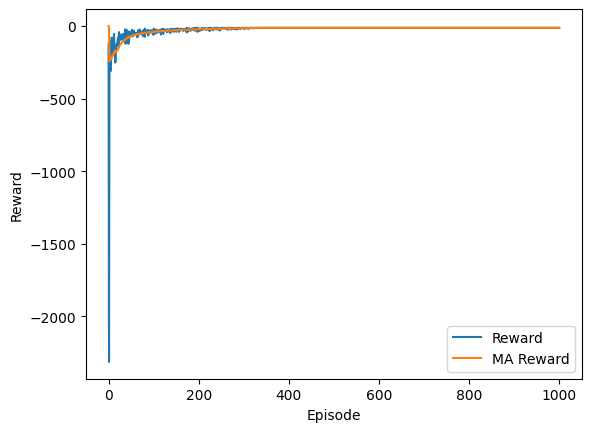

## Q-Learning异策略时序差分算法

1. Q学习是一种异策略时序差分算法
   - 行为策略：行为策略可以是一个随机的策略，但是我们并不希望策略完全随机，因此我们还是采用epsilon贪心，在Q表格的基础上来进行随机
   - 目标策略直接在Q表格上使用贪心策略，取它下一步能得到的最佳动作
     - $\pi(s_{t+1}) = \underset{a'}{argmax} Q(s_{t+1, a'})$
2. Q学习：我们同样用时序差分的方式来更新Q表，不同的是我们使用目标策略更新Q值
   - 时序差分的目标是：
     - $$r_{t+1}+\gamma Q(s_{t+1}, A') = r_{t+1}+\gamma Q(s_{t+1}, argmax Q(s_{t+1}, a')= r_{t+1}+\gamma \underset{a'}{max} Q(s_{t+1},a')$$
   - 将学习写成增量学习的形式
     - 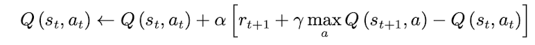

3. epsilon衰减：可以看到即是没有使用该方法，策略也收敛到了最优

4. 代码实现

   ```python
   class QLearning():
       def __init__(self, cfg, n_action, n_states):
           self.gamma = cfg.gamma
           self.alpha = cfg.alpha
           self.epsilon = cfg.epsilon
           self.action_space = n_action
           self.observation_space = n_states
           
           # 初始化Q表
           self.Q_table = defaultdict(lambda: np.zeros(self.action_space))
   
       # ε-贪心策略
       def choose_action(self, state, train=True):
           if not train:
               return np.argmax(self.Q_table[state])
           
           if random.uniform(0, 1) < self.epsilon:
               action = random.randint(0, self.action_space - 1)
           else:
               action = np.argmax(self.Q_table[state])
           return action
   
       # Q-Learning 更新
       # Q-Learning更新直接采用了贪心算法，这实际上代表了目标策略
       # 而在训练选取动作时采用了ε-贪心策略，这代表了行为策略
       def update(self, state, action, reward, next_state, done):
           predict = self.Q_table[state][action]
           
           if done:
               target = reward
           else:
               target = reward + self.gamma * np.max(self.Q_table[next_state])
           
           self.Q_table[state][action] += self.alpha * (target - predict)
   agent = QLearning(cfg, n_action, n_states)
   ```

5. 补全训练和测试代码

   ```python
   reward_history = []
   ma_reward_history = [0]
   for episode in tqdm(range(cfg.n_episodes), desc="Training Episodes"):
       state, _ = env.reset()
       ep_reward = 0
   
       while True:
           action = agent.choose_action(state)
           next_state, reward, terminated, truncated, _  = env.step(action)
           done = terminated or truncated
           agent.update(state, action, reward, next_state, done)
           state = next_state
           ep_reward += reward
           if done:
               break
       reward_history.append(ep_reward)
       if ma_reward_history:
           ma_reward_history.append(0.9 * ma_reward_history[-1] + 0.1 * ep_reward)
   
   # 推理模式
   state, _ = env.reset()
   ep_reward = 0
   trajectory = []
   
   
   while True:
       action = agent.choose_action(state, train= False)
       next_state, reward, terminated, truncated, _ = env.step(action)
       done = terminated or truncated
   
       trajectory.append((state, action, reward))
       state = next_state
       ep_reward += reward
   
       if done:
           break
   
   ```

6. 结果：策略最终收敛到最佳奖励-13

   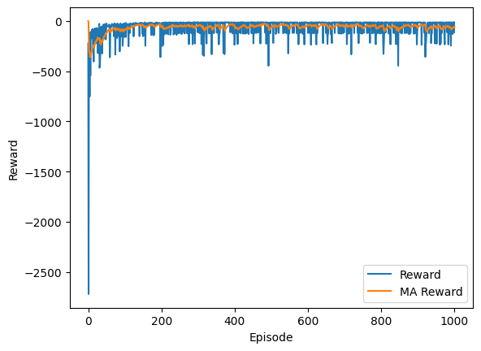

## 从一个错误的实现看两种算法的区别

1. 看一个错误的实现

   ```python
   class Self_SARSA():
       def __init__(self,cfg, n_action, n_states):
           self.gamma = cfg.gamma
           self.alpha = cfg.alpha
           self.epsilon = cfg.epsilon
           self.action_space = n_action
           self.observation_space = n_states
           self.Q_table = defaultdict(lambda: np.zeros(self.action_space))
   
   
       def choose_action(self, state):
           choice = self.Q_table[state]
           action = np.argmax(choice)
           return action
   
   
       def update(self, state, action, reward, next_state, done):
           next_action = self.choose_action(next_state)
           self.Q_table[state][action] = self.Q_table[state][action] + self.alpha*(reward+self.gamma*self.Q_table[next_state][next_action]-self.Q_table[state][action])
           
   
   
   agent = Self_SARSA(cfg, n_action, n_states)
   ```

2. 这是一个错误的实现，虽然意外效果很好的收敛到了最优，但是这里实现问题颇多

   - 没有采用epsilon贪婪，因此收敛飞快，可是这仅仅是因为问题很简单，没有太多探索也收敛到最优
   - 这里虽然想实现Sarsa，但是更新的时候采用了在内部观察了next_action，但是这个action由于没有采用epsilon贪婪，实际上是argmax操作，等价于Q学习的更新。
   - 如果使用了epsilon贪婪，由于动作加入了随机性，update内执行choose_action不一定是下一步真实执行的动作，这不满足sarsa，同时由于epsilon贪婪存在，执行的也不一定是argmax，因此得到的反而既不是Qlearning，也不是sarsa了
     - 测试发现，如果不修改其他的情况下加入epsilon贪婪，训练无法收敛

3. Sarsa V.S. Q-Learning

   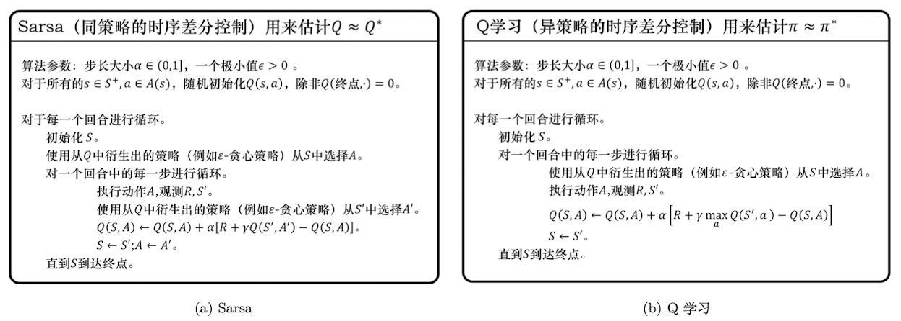

   - 可以看到本质上Sarsa和Q-Learning的区别在于更新时采用的目标

     - Sarsa需要是下一步实际执行的动作
     - Q-Learning直接选择Q值最大的动作就行

   - 在实现上

     - Sarsa的更新需要在训练函数中提前计算出下一步动作，传入，保证执行的动作就是更新用到的动作
     - Q-Learning直接选择Q值最大的动作，不需要传入下一步动作

     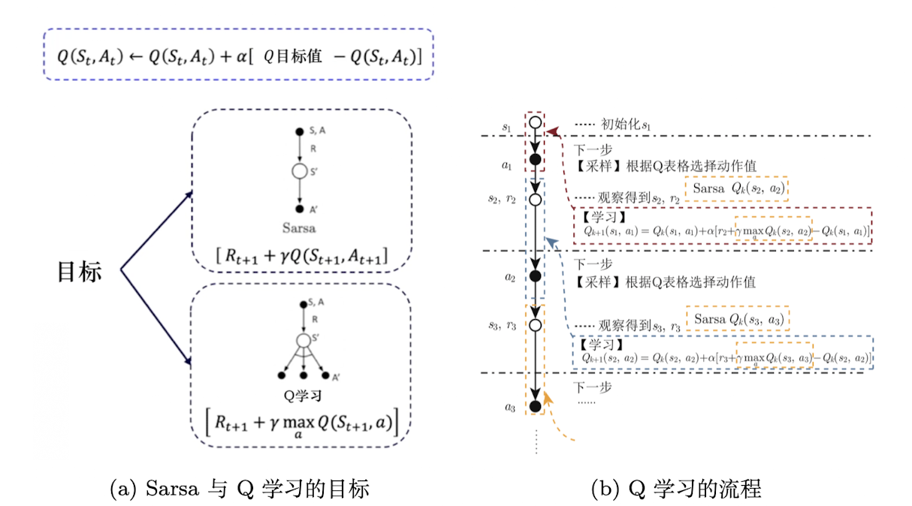

4. 最后再次对比同策略和异策略的区别

   | **对比维度**        | **同策略（On-policy）**             | **异策略（Off-policy）**                 |
   | ------------------- | ----------------------------------- | ---------------------------------------- |
   | 代表算法            | **Sarsa**                           | **Q-learning**                           |
   | 策略数量            | 1 个策略                            | 2 个策略                                 |
   | 策略类型            | 学习策略 = 行为策略                 | 行为策略 ≠ 目标策略                      |
   | 行为策略            | π（通常为 ε-贪心）                  | ε-贪心                                   |
   | 目标策略            | π（同一个）                         | 贪心策略（max）                          |
   | 是否分离学习与行为  | ❌ 不分离                            | ✅ 分离                                   |
   | 与环境交互用的策略  | 当前学习的策略 π                    | 行为策略                                 |
   | 用于更新 Q 的策略   | 当前执行的策略                      | 目标策略                                 |
   | 是否需要兼顾探索    | ✅ 需要                              | ❌ 不需要                                 |
   | 探索是否影响更新    | 是                                  | 否                                       |
   | 更新是否取最大值    | ❌ 不取 max                          | ✅ 取 max                                 |
   | 更新依据            | 实际执行的下一个动作                | 理论上的最优动作                         |
   | 更新公式            | Q(s,a)←Q(s,a)+α[r+γQ(s',a')−Q(s,a)] | Q(s,a)←Q(s,a)+α[r+γ\max Q(s',a')−Q(s,a)] |
   | 策略是否随训练变化  | 是（ε 逐渐减小）                    | 行为策略变，目标策略稳定                 |
   | 策略稳定性          | 相对不稳定                          | 相对稳定                                 |
   | 风险态度            | 保守                                | 激进                                     |
   | 学习风格            | 现实主义                            | 理想主义                                 |
   | 对噪声/探索的敏感性 | 高                                  | 低                                       |
   | 收敛速度            | 较慢                                | 较快                                     |
   | 收敛目标            | 当前策略的最优值                    | 全局最优策略                             |
   | 悬崖行走表现        | 远离悬崖，走安全路径                | 贴近悬崖，走最短路径                     |
   | 对失败的容忍度      | 低（避免高风险）                    | 高（允许探索失败）                       |
   | 适用场景            | 高风险、对安全要求高                | 低风险、追求最优效率                     |


## 蒙特卡洛方法

1. 相比于前两种方法，蒙特卡洛并不适用于这个问题

1. 蒙特卡洛方法：每次采样完整轨迹，使用完整轨迹对q表格进行更新

   - 由于要采样完整轨迹，蒙特卡洛方法天然不适用无限步数的游戏
   - cliffwalking中撞墙不会终止游戏，这使得游戏可能出现无限补偿
   - 必须加入截断，在到达一定步数停止游戏，否则agent可能会卡在一个位置，导致游戏无法完整收集一个回合

2. 蒙特卡洛方法在cliffwalking问题下的训练难点：

   - 高方差，低偏差：体现在悬崖行走问题的训练中：

     - 是否掉落悬崖是一个巨大的离散跳变：
       - 同样从起点出发：
         - 一条安全路线可能走得更远：回报大概是 $-1\times\text{步数}$。
         - 一次不小心（尤其是 ε-greedy 探索时）靠近悬崖边缘就可能掉下去，立刻吃到 -100 的巨额惩罚。 
       - 于是 G 会在“正常负数”和“突然极大负数”之间跳，样本间差异巨大 ⇒ **方差极高**。

     - **ε 的两难**
       - epsilon过小：由于要收集完整轨迹才能更新，在有truncate的情况下，过小的探索可能根本没有办法让模型学习探索最佳路径，而是进入坏循环、绕路，导致最终的奖励搜索到-1*truncate步数
       - epsilon过大：引入非常大的方差，导致模型无法收敛
       - 方案：给出一个非常大的epsilon初期探索路径，但是必须更快速的减小，让后期的规划更稳定

   - 相比时序差分更难收敛：
     - **本质差异：更新粒度不同。**
       - **MC：**拿“整段累计回报”当监督信号（episode 结束才更新）
       - **TD：**用一步或 n 步 bootstrap，**每一步就能更新**（更早获得学习信号）
     - 在 CliffWalking 的早期，策略往往很差，常出现绕路、来回走、反复撞墙/循环导致 episode 长度变化巨大：
       - 轨迹很长 → 累计 -1 很多，回报更差
       - 偶尔又可能很快到终点 → 回报又“没那么差”
     - 对 MC 来说：**方差进一步上升**
       - “轨迹长度波动 + 是否掉悬崖跳变”叠加在一起
       - 使得 G 的波动空间更大
     - 同时由于 MC 必须“等整条轨迹结束”才能得到一次更新：⇒ **表现为比 TD 更难稳定收敛**
       - 早期采样效率低
       - 更新信号噪声大
       - 策略改进慢

3. 对比Sarsa和Q-Learning方案：

   - 加入截断：变成有限的游戏
     - 截断长度要大于100，否则模型会宁愿在原地等死也不冒险脚滑掉入悬崖
   - 给出一个非常大的epsilon初期探索路径，但是必须更快速的减小，让后期的规划更稳定：使agent能探索到最优路径，后期也能收敛
   - First visit：在初期绕路的时候，避免奖励强自相关

4. MC代码

   ```python
   class MC():
       def __init__(self):
           self.gamma = cfg.gamma
           self.alpha = cfg.alpha
           self.epsilon = cfg.epsilon
           self.action_space = n_action
           self.observation_space = n_states
           
           # 初始化Q表
           self.Q_table = defaultdict(lambda: np.zeros(self.action_space))
   
           self.epsilon_start = 0.9#high cfg.epsilon
           self.n_epsisodes = cfg.n_episodes
           self.epsilon_end = 0
   
       def choose_action(self, state, episode, train = True):
           if not train:
               return np.argmax(self.Q_table[state])
           self.epsilon = self.epsilon_end + (self.epsilon_start - self.epsilon_end) * \
           math.exp(-1. * episode / (self.n_epsisodes/3))# converges faster
   
           
           if random.uniform(0, 1) < self.epsilon:
               action = random.randint(0, self.action_space - 1)
           else:
               action = np.argmax(self.Q_table[state])
           return action
           
   
       def update(self, trajectory):
           G = 0
           visited= set()
           for state, action, reward in reversed(trajectory):
               G = reward + self.gamma * G
   					# first visit
               if (state, action) not in visited:
                   self.Q_table[state][action] += self.alpha * (G - self.Q_table[state][action])
                   visited.add((state, action))
               
   agent = MC()
   ```

   

5. 训练代码

   - ```python
     env = gym.make("CliffWalking-v0")
     env = gym.wrappers.TimeLimit(env, max_episode_steps=200)
     reward_history = []
     ma_reward_history = []
     q_history = []  # 用于记录每一步的Q表快照
     q_history.append(np.stack([agent.Q_table[s] for s in range(48)], axis=0))  # (48, 4)
     
     for episode in tqdm(range(10000), desc="Training Episodes"):
         ep_reward = 0
         state, _ = env.reset()
         done = False
     
         trajectory = []   # [(state, action, reward), ...]
     
         # ---- 生成一条完整轨迹 ----
         while not done:
             action = agent.choose_action(state, episode)
     
             next_state, reward, terminated, truncated, _ = env.step(action)
             done = terminated or truncated
     
             trajectory.append((state, action, reward))
             ep_reward += reward
             state = next_state
     
         agent.update(trajectory)
         q_history.append(np.stack([agent.Q_table[s] for s in range(48)], axis=0))  # (48, 4)
         
         reward_history.append(ep_reward)
         if ma_reward_history:
             ma_reward_history.append(0.9 * ma_reward_history[-1] + 0.1 * ep_reward)
         else:
             ma_reward_history.append(ep_reward)
     
     # 推理模式
     state, _ = env.reset()
     ep_reward = 0
     trajectory = []
     
     
     while True:
         action = agent.choose_action(state, episode, train = False)
         next_state, reward, terminated, truncated, _ = env.step(action)
         done = terminated or truncated
     
         trajectory.append((state, action, reward))
         state = next_state
         ep_reward += reward
     
         if done:
             break
     
     ```

6. 结果

   - 由于是同策略，模型不愿意冒风险选择了远离悬崖
     - 最终收敛到17，选择了最靠边的路线
   - 模型非常难训练

   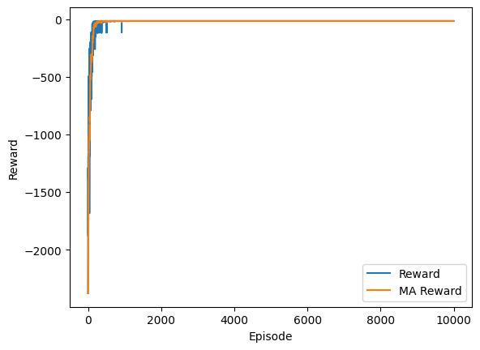

接下来进入策略梯度，将在algo中结合代码继续学习
