# 深度强化学习

1. 深度强化学习：不使用表格记录具体值，而是将策略给参数化
   - 基于策略的学习：策略梯度
   - 基于价值的学习：Q学习

## Policy Gradient

1. 策略梯度：假设参数为$\theta$的策略为$\pi_\theta$，该策略为随机性策略，其输入为某个状态，输出一个动作的概率分布
   - 基于策略的方法，对策略进行了参数化
   - 策略梯度不需要再动作空间中最大化价值，因此较为适合解决具有高维或者连续动作空间的问题

## 策略梯度算法-强化学习为例

1. 强化学习（Reinforce）算法有三个组成部分，演员、环境和奖励函数

   - 这里是Reinforce专有的算法名称，不是统称意义上的强化学习
   - 以视频游戏为例

   - 演员：演员是负责操控游戏的摇杆，可以选择各种操作
   - 环境：游戏的主机，负责控制游戏的画面、怪兽的移动
   - 奖励函数：当我们做某件事情或者发生某个状况时，可以得到的分数（击杀怪兽）

2. 强化学习中环境环境和奖励函数是给定的，我们要做的事调整演员的策略，即给定一个输入，输出演员现在要执行的策略

   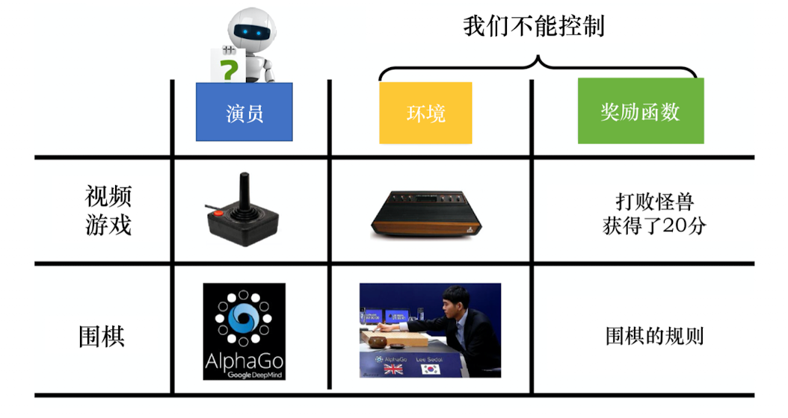

3. 定义一个深度强化学习问题：		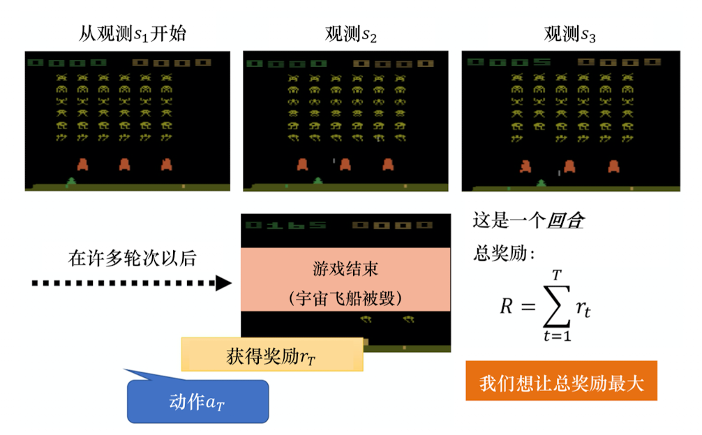

   - 策略是一个网络：

     - 对于策略$\pi$，$\theta$是策略网络的参数
     - 网络的输入是智能体能看到的东西
       - 比如游戏画面
     - 网络的输出是要执行的动作
       - 对于离散的动作可以有几个动作就有几个神经元
         - 每个神经元代表一种动作
         - 每个神经元输出的分数是一个概率，对应每种动作执行的**概率**

   - 状态：初始游戏画面可以记为$s_1$...

   - 动作：第一次执行的动作可以记为$a_1$...

   - 回合：一场游戏称为一个回合

   - 环境：可以视为一个函数，输入一个动作，输出新的状态（也可以是一个概率）

   - 轨迹：一场游戏中，环境输出的s与演员动作a全部组合起来，称为一个轨迹

     - $$\tau = \{s_1, a_1,s_2, a_2, ...s_t,a_t\}$$

     - 给定演员的参数$\theta$，可以计算某种轨迹发生的概率

       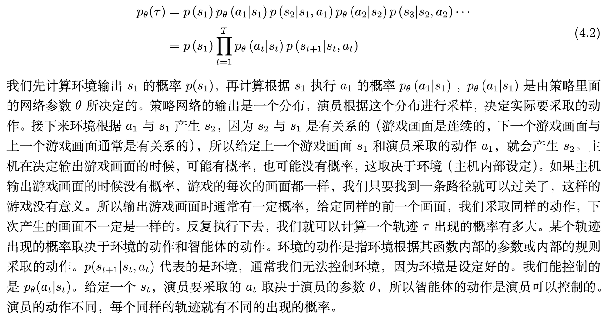

   - 奖励：可以视为一个函数，输入$s_i, a_i$，输出$r_i$
     - 在$s_1$执行$a_1$得到的奖励记为$r_1$...
   - 总奖励：将一场游戏的总奖励加和得到就是总奖励，对于一个轨迹$\tau$，总奖励也称为回报，可以记为$R(\tau)$

4. 策略梯度

   - 演员要想办法最大化它可以得到的奖励：在某一场游戏的某一个回合里，可以得到$R(\tau)$，我们要做的事调整演员内部参数$\theta$，使得$R(\tau)$越大越好
     - 对于参数$\theta$，策略$\tau$，$R(\tau)$是一个随机变量，我们可以计算它的期望
       - $$\bar{R_\theta} = \sum_{\tau}R(\tau)p_\theta(\tau)$$
   - 期望奖励
     - 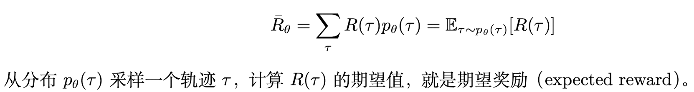

   - 最大化期望奖励：使用梯度上升可以最大化期望奖励

     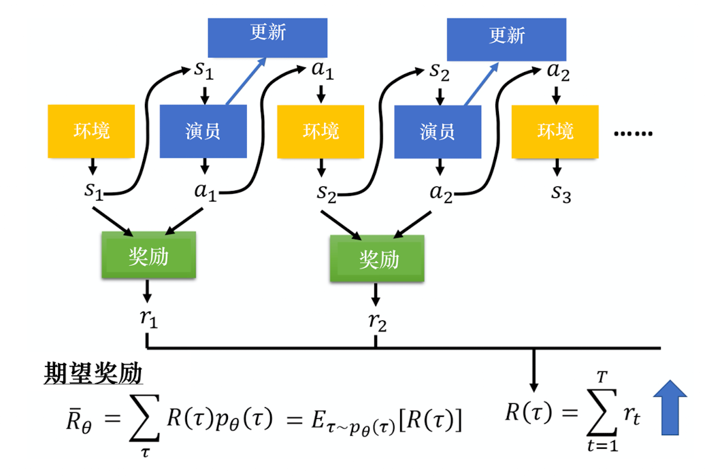

     - 计算梯度期望奖励关于策略参数$\theta$的梯度
       - 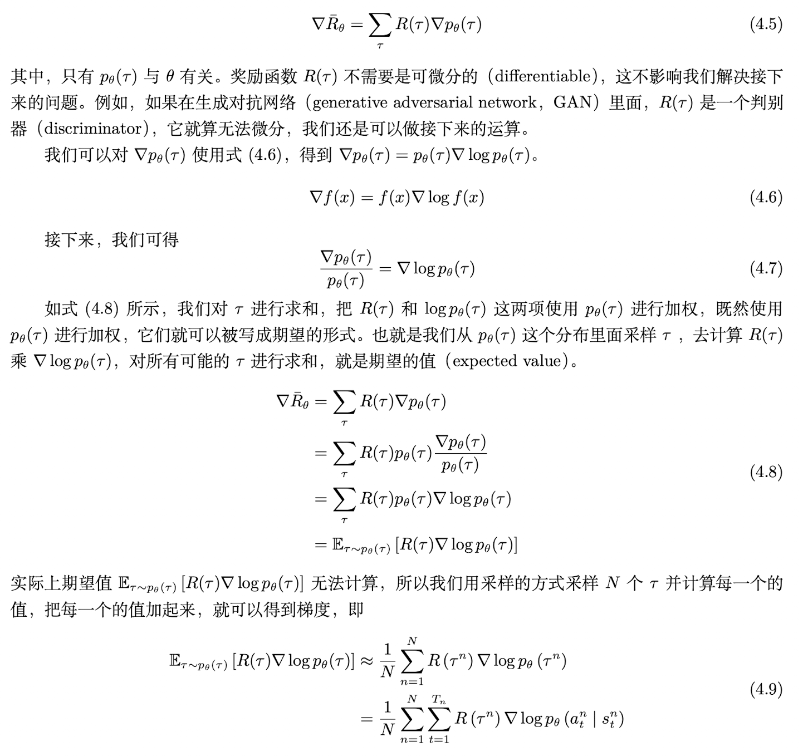

   - 通过马尔科夫链条件概率展开，可以计算$\nabla log p_{\theta}(\tau)$

     - 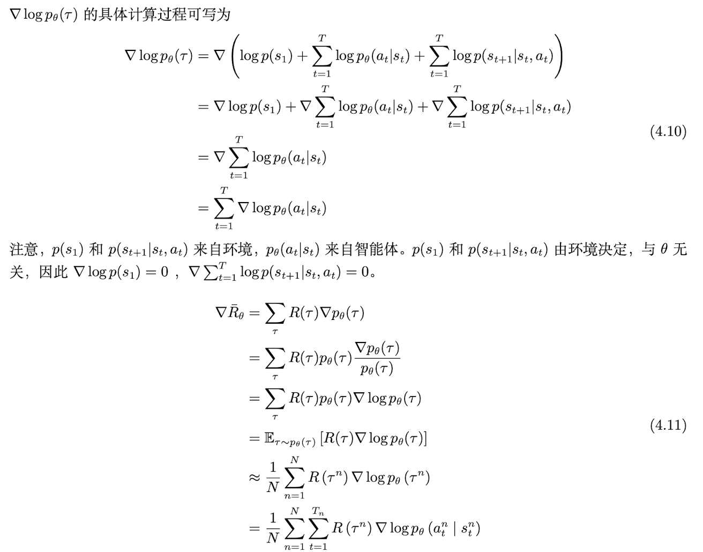

     - 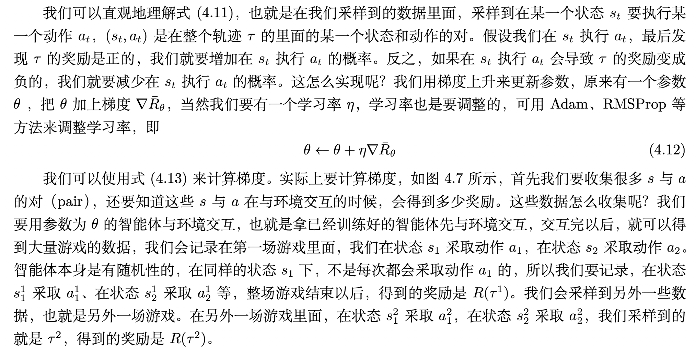
     - 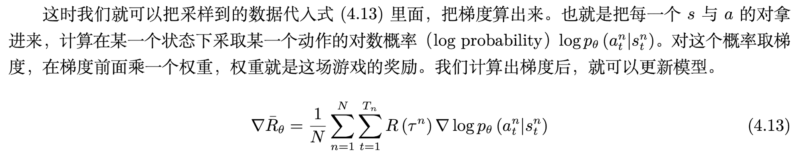
     - 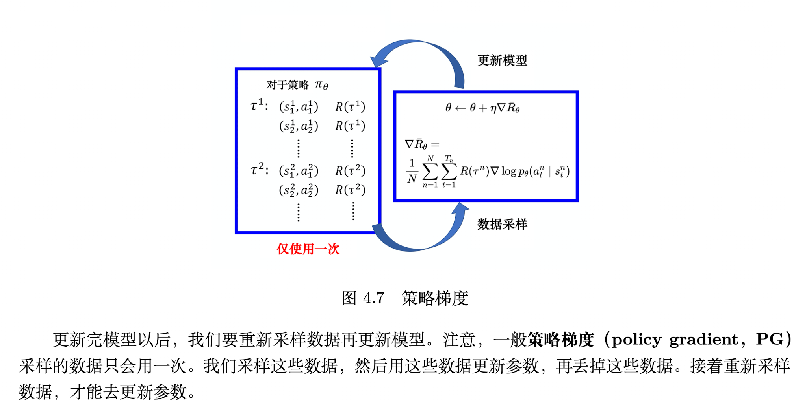

5. 深度强化学习建模
   - 离散决策问题：本质是分类问题，输入状态，输出动作

   - 数据收集：通过采样来获得数据

     - 采样过程中，如果在某种状态下采样到动作a，那么就把动作a当做标准答案

   - 目标函数：最大化似然$\nabla \bar{R_\theta}$，即用总奖励加权（注意不是状态s采取a动作，而是总奖励）的以下函数

     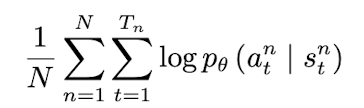

     - 一般的分类问题：最小化交叉熵，最小化交叉熵的本质是最大化对数似然
       - 调整参数使得出现某种结果的可能性最大
       - 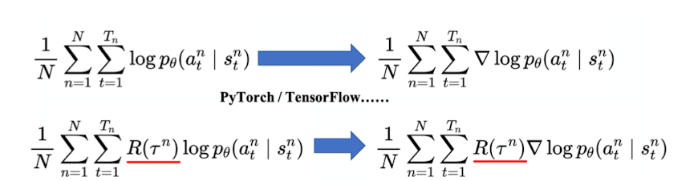

6. 策略梯度与分类问题对比

   - 以手写体分类为例，输入图片，输出各种类别概率，目标是输出的概率分布逼近真实概率分布

   - 交叉熵：可以表示两个概率分布的差距

     - 对于二分类问题，交叉熵就是二项分布的负对数似然

     - 从信息论角度：用模型分布 q 来编码真实分布 p 时的平均编码长度

       - 真实世界按 p 产生数据
       - 你却用模型 q 去预测
       - 交叉熵衡量：你因为预测错误而多付出的信息代价

     - 分布中：$H(p,q) = H(p) + KL(p||q)$

       - 交叉熵：世界本身的不确定性，加上模型的错误
         - $H(p,q) \;=\; -\sum_{x\in\mathcal{X}} p(x)\,\log q(x)$
       - H(p)是香农熵:表示Hp是最优编码下，每个符号所需要的最少平均比特数
         - $H(p) \;=\; -\sum_{x\in\mathcal{X}} p(x)\,\log p(x)$
         - 衡量了本身的不可预测性，不确定性、随机性、混乱程度、可压缩性
           - 接近均匀分布越随机，不确定、混乱，不可压缩
           - 某个概率极端不均匀$p = (0.99,0.11)$：几乎总是同一个结果，不需要太多信息
         - 给定真实分布p，Hp是固定的

       - KL散度：当真实分布是 p，但你用 q 来描述世界时，平均多付出的信息代价。
         - $KL(p\|q) \;=\; \sum_{x\in\mathcal{X}} p(x)\,\log\frac{p(x)}{q(x)}$
         - 是一个似然比，衡量了p比q的优势
         - 不对称，不是距离

   - 策略梯度预测的是每个动作的概率，由于没有真实标签，我们使用采样到的动作作为标签，处于补偿，我们用奖励汇报Gt（该动作未来回报的折现）来表示该动作的评价，

### 策略梯度实现技巧

1. 添加基线：

   - 一个问题：如果给定状态s采取动作a，整场游戏都得到正的奖励，那么就要增加(s,a)的概率，如果同样情况下正常游戏都是负的奖励，那么就要减小(s,a)的概率

     - 但是如果奖励总是正的呢？

     - 理想情况下

       - 由于R都是正的，模型会被要求提升所有可能动作的概率，R高的增加的多，R少的增加的少

       - 概率和为1，对数概率和为0，提高少（b）的在做完归一化后，概率是下降的，提高多的概率是上升的（a、c）

         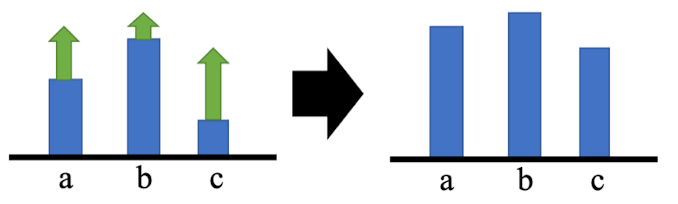

     - 实际情况下

       - 使用采样来计算期望：对所有可能得s和a的对进行求和
       - 但是真正学习的时候只采样了少量s和a的对，可能很多动作从来都没有被采样到
       - 如下图，a动作从来没被采样到，因此a的概率下降，b和c的概率提高
         - 产生了偏差，a下降并不是因为他不好

   - 方案：让奖励并不总是正的

     - 给奖励设置一个基线b，将所有奖励减去b

       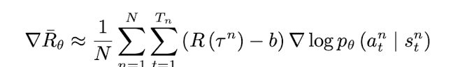

     - 基线b的设计：对$\tau$取期望，计算平均值，令$b \approx E[R(\tau)]$
       - 在训练时，通过不断把$R(\tau)$记录下来，动态计算其平均值

2. 分配合适的分数

   - 原本的公式中，同一场游戏里所有状态动作对都是用同样的奖励进行加权

     - 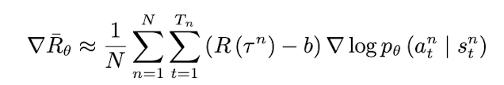

   - 问题：同一场游戏中有些动作是好的，有些动作是坏的，整场游戏的结果是好的不代表每一个动作都是好的，反之亦然

     - 理想状况下，采样足够多的时候，各种因素抵消，总的奖励可以反应其中动作好坏，但是采样不足的时候，这是没有代表性的

   - 解决方法：

     - 一个做法是不要把正常游戏的奖励全部加起来，而是只计算这个动作之后的到的奖励

       - 因为动作发生前得到的奖励和这个动作是无关的

         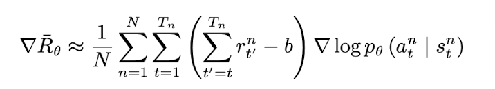

     - 更进一步，可以对未来奖励计算折扣

3. 优势函数$A^\theta(s_t,a_t)$：结合上面两个技巧

   - b可以是依赖状态的，由网络进行估计，R-b称为优势函数
   - 未来期望的加总需要一个模型和环境进行交互，才能知道接下来的奖励
   - 优势函数上的$\theta$代表用来与环境交互的模型$\theta$
   - 优势函数的意义：假设在某一个状态st执行一个动作at，相较于其他动作，at有多好
     - 相对优势：不在乎绝对的好，而是相对的好，基线b就是这个动作相对好的程度
   - 优势函数如果使用网络估计，这个网络就成为评论员

### Reinforce算法 蒙特卡洛梯度

1. 蒙特卡洛和时序差分

   - 蒙特卡洛方法：完成一个回合，再利用回合的数据进行学习，做更新

     - 因为得到了整个回合的数据，因此可以获得每一步的奖励，也可以计算每个步骤未来的奖励总和

   - 时序差分：每个步骤更新一次

     - 更新频率更高，时序差分方法的Q函数可以近似未来总奖励$G_t$

       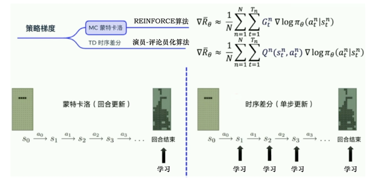

2. REINFORCE：策略梯度的最经典的算法

   - 更新方式：回合更新

     - 先获得每个步骤的奖励，然后计算每个步骤未来的总奖励Gt，然后代入策略梯度公式

       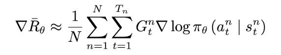

     - 设计一个函数，输入是每一个步骤获得的奖励，输出的是每一个步骤的未来总奖励

       - 即上一个步骤和下一个步骤的未来总奖励的关系，在代码上是reverse然后递推向前

       ​	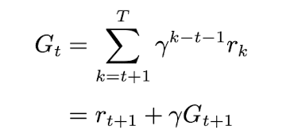

   - 伪代码

     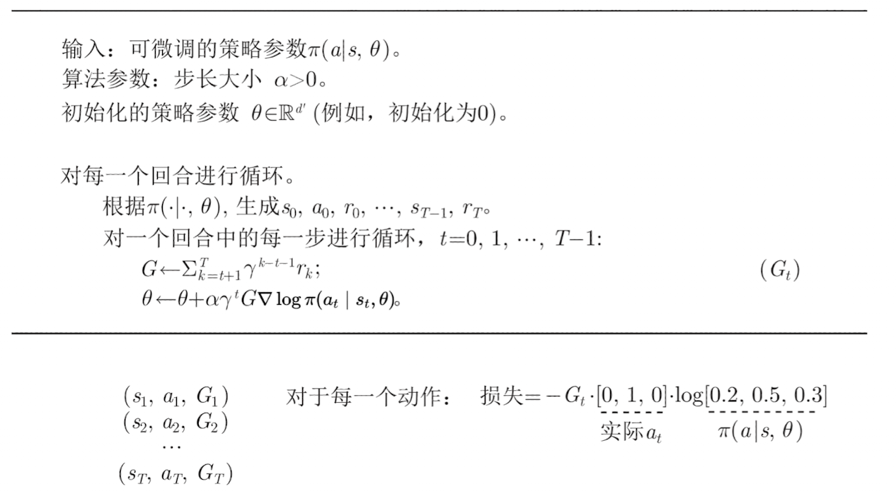

   - 损失计算：取动作独热向量和每个动作的对数概率相乘，构建损失，R是一个常数，通过计算概率对策略参数的梯度来最大化期望奖励

     - 对每一个轨迹获得一个损失，求和给优化器优化

     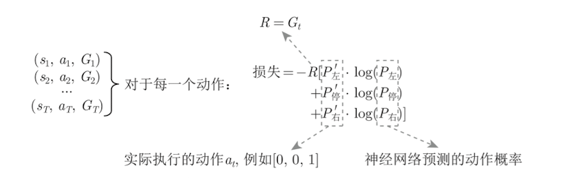

   - 采样：

     - 需要一个策略模型输出动作概率，输出动作概率后，通过sample获得一个具体的动作和环境交互，得到整个回合的数据，然后执行learn函数进行优化

       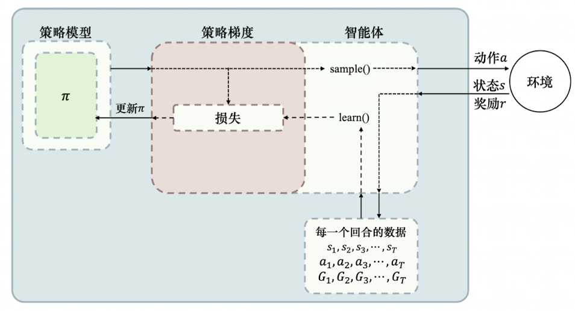

## 深度Q网络算法

1. 传统强化学习的问题：使用表格记录状态价值函数或动作价值函数
   - 连续空间，无穷多状态，无法使用表格
   - 方法：使用价值函数近似，利用函数直接拟合状态价值函数或者动作价值函数，降低对存储空间的要求
2. 价值函数近似：在连续的状态和动作空间中计算值函数，可以用一个函数来近似计算，成为价值函数近似
   - $$Q_\phi(s,a) \approx Q_{\pi}(s,a)$$
   - 其中s，a分别是状态s和动作a的向量表示，函数通常是一个参数为$\phi$的函数，比如神经网络，其输出一个实数，成为Q网络
3. 深度Q网络：基于深度学习的Q学习方法，结合了价值函数近似于神经网络技术，采用目标网络和经验回放的的方法来进行网络的训练
   - 深度Q网络：基于价值的算法，学习的不是策略，而是评论员
4. 演员：学习一个策略来得到尽量高的回报
5. 评论员：评价（演员）动作的好坏
   - 实际上做的事策略评估
   - 两种评论员
     - 状态价值函数评论员$V_\pi$
     - 动作价值函数评论员Q函数

### 状态价值函数

1. 状态价值函数评论员$V_\pi$​：假设演员的策略是$\pi$，使用$\pi$和环境交互，当智能体看到状态s时，接下来的累计奖励的期望值是多少

   - 接受s输出一个标量

   - 问题：评论员无法凭空判断状态的好坏，他评价的是给定某一个状态的时候，接下来交互的演员的策略是$\pi$，我们会得到的奖励是多少

     - 同样的状态，策略不一样，得到的奖励也不一样

     - 评论员需要绑定一个演员，评论员的输出值取决于状态和演员，它在衡量某一个演员的好坏而不是状态的好坏
     - 评论的输出是和演员有关的，状态的价值实际取决于演员，当演员改变状态价值函数的输出其实也会跟着改变

2. 状态价值函数的计算：

   - 蒙特卡洛：

     - 让演员和环境交互，看演员好不好就让演员和环境交互，让评论员评价

     - 评论员统计演员如果看到某个状态s，接下来的累计奖励有多大

     - 然后用状态价值函数近似网络进行估计，由于网络有泛化能力，在有限的观察中尽量学出全部规律

       - 回归问题：输入状态s，输出价值G

       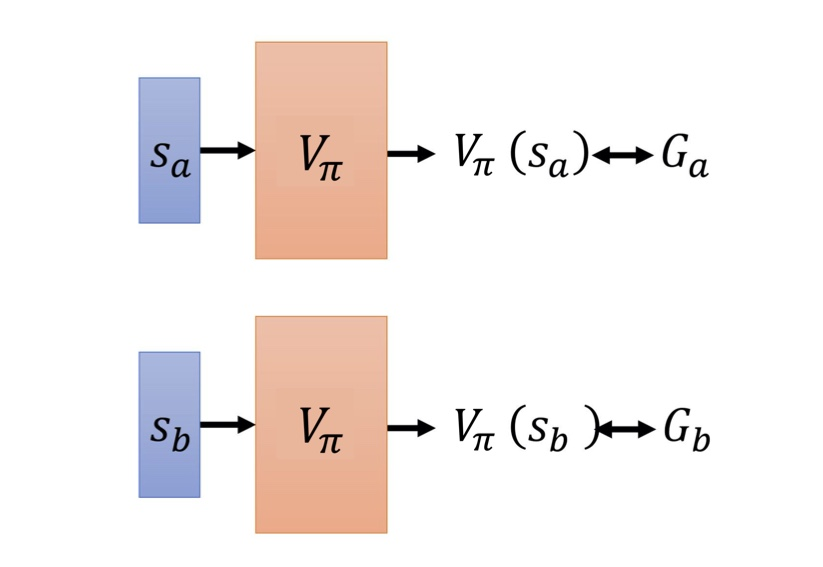

   - 时序差分：在某状态$s_t$，采取动作$a_t$等到奖励$r_t$，接下来进入状态$s_{t+1}$

     - $V_\pi(s_t) = V_\pi(s_{t+1})+r_t$

     - 不直接估计$V_\pi$，而是希望得到的结果$V_\pi$可以满足上式子

       - 输入$s_t$得到$V_\pi(s_t)$
       - 输入$s_{t+1}$得到$V_\pi(s_{t+1})$
       - $V_\pi(s_{t+1})$与$V_\pi(s_t)$的差应该是$r_t$ 希望损失的详见和奖励接近

       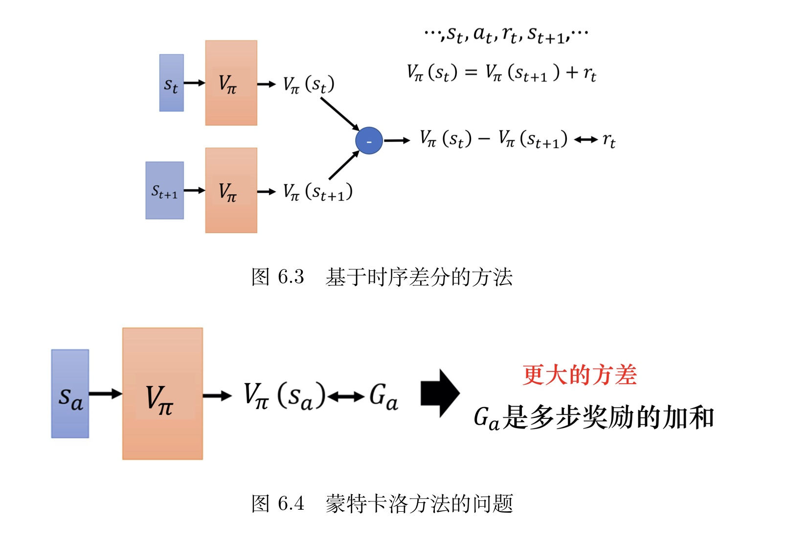

   - 蒙特卡洛vs时序差分

     - 方差区别

       - 需要再次说明的是，蒙特卡洛方差更大
         - 因为游戏和模型本身都有随机性
         - $G_a$是多步奖励的和，$Var[kX] = k^2Var[X]$，通过多步骤的累计，相比于某一个状态的奖励，方差是很大的
       - 时序差分的目标是最小化$Var_\pi(s_t) <-->r+V+\pi(s_{t+1})$
         - r具有随机性，即便在s采取同一个动作，奖励也不一定都是一样的
         - G是多步r的求和，因此方差更大
       - 问题：$V_\pi$不一定准确，假设$V_\pi$不准确，使用上面目标学出来的结果也不准确
         - 因此蒙特卡洛和时序差分各有优劣
         - 时序差分更常用，蒙特卡洛方法比较少

     - 计算结果区别

       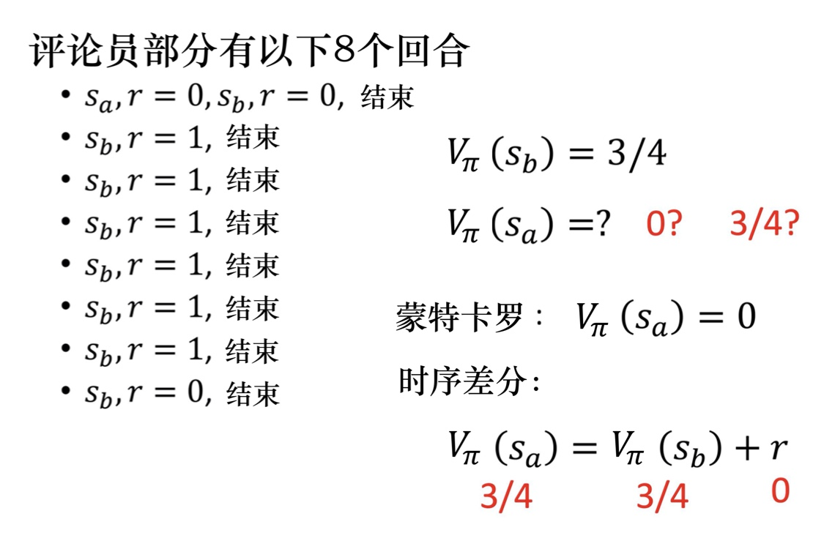

       - 场景：假设某个评论员，它去观察某一个策略$\pi$与环境交互8个回合的结果

         - 有一个有sa
         - 剩下都是sb

       - sb的计算：8场游戏，sb都存在，计算看到sb后得到的奖励，期望是3/4

       - sa的计算：

         - 蒙特卡洛：
           - sa出现一次，看到sa接下来的累计奖励就是0，所以sa的期望奖励就是0
         - 时序差分：
           - 更新$Var_\pi(s_a) = r+V+\pi(s_b)$
           - 在状态a得到奖励0之后，进入状态sb，sa的奖励等于状态sb的期望奖励加上从状态sa进入状态sb的期望奖励r
             - r = 0
             - sb = 3/4
             - sa的奖励是3/4

       - 为啥不一样？sa这个时间的存在有两种可能

         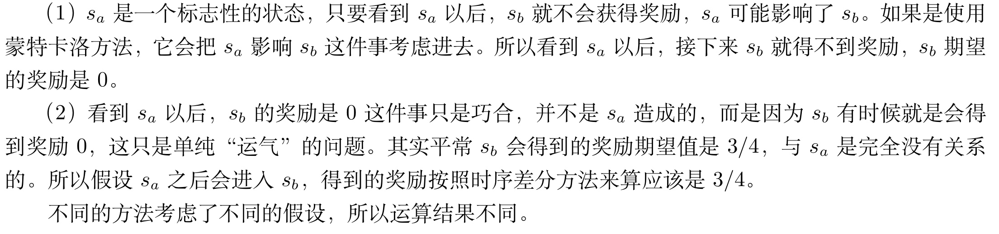

### 动作价值函数

1. 动作状态值函数评论员Q函数：输入一个状态-动作对，即在某一个状态采取某一个动作，假设都是用策略$\pi$，得到的累计奖励的期望值有多大
   - 状态价值函数输入一个状态，根据状态计算出这个状态以后的期望的累计奖励是多少
2. Q函数要注意的问题
   - 策略在看到状态s时，不一定采取动作a
   - Q函数强制状态s采取动作a，而不管策略会不会采取a
     - 这并不重要
   - 在某个状态强制执行一次动作，然后接下来让策略自己继续玩，这样可以得到期望奖励$Q_\pi(s,a)$
3. Q函数的两种写法

## 演员-评论家算法

1. Reinforce的问题：每次需要采集一个完整的轨迹，并计算轨迹上的回报
   - 采样方差大
   - 学习效率低
2. 方案：借鉴时序差分的思想，使用动态规划方法来提高采样效率
   - 从状态s开始的总回报可以通过当前动作的即时奖励$r(s,a,s')$和下一个状态$s'$的值函数来近似估计
3. 演员-评论家算法：结合策略梯度和时序差分学习的强化学习方法
   - 演员：策略函数$\pi_\theta (a|s)$
     - 学习一个策略以得到尽可能高的回报
   - 评论员：价值函数$V_\pi(s)$
     - 对当前策略的值函数进行估计，评估演员的好坏
   - 借助价值函数，演员-评论员孙发可以进行单步参数更新，不需要等到回合结束才进行更新
4. 演员评论员算法变体：
   - 优势演员评论家算法：A2C
   - 异步优势演员评论家算法：A3C

5. 策略梯度回顾：

   

   - 策略梯度中

     - 表示我们首先通过智能体与环境的交互，可以计算出在某一个状态 s 采取某一个动作 a 的概率 $p_\theta(a_t|s_t)$
     - 接下来，我们计算在某一个状态 s 采取某一个动作 a 之后直到游戏结束的累积奖励。
     - $\sum_{t'=t}^{T_n} \gamma^{t'-t} r_{t'}^n$ 表示我们把从时间 t 到时间 T 的奖励相加，并且在前面乘一个折扣因子，通常将折扣因子设置为 0.9 或 0.99 等数值，与此同时也会减去一个基线值 b，减去值 b 的目的是希望括号里面这一项是有正有负的。
       - 如果括号里面这一项是正的，我们就要增大在这个状态采取这个动作的概率
       - 如果括号里面是负的，我们就要减小在这个状态采取这个动作的概率

   - 用G表示累计奖励，G非常不稳定，因为交互的过程本身有随机性

     - 在某一状态s采取动作a时计算得到的累计奖励，每次结果是不同的
     - G是一个随机变量，对于同样的状态s和同样的动作a，G可能有一个固定的分布
     - 但由于通过采样收集数据，因此将某一个状态s采取动作a后知到游戏结束的奖励称为了G

   - 如果把G想象成一个随机变量

     - 实际上是在对G做采样，用采样的结果更新参数

     - G本身有潜在的固定分布，但是方差可能会非常大，因此收集到的G结果可能会非常不一样

     - 如果可以采样足够多次那么没有问题

     - 如果非常小的采样导致采样道德数据方差很大，结果会很差

       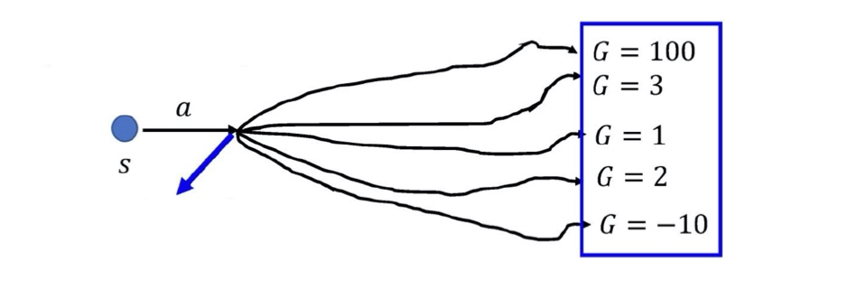

6. 深度Q网络回顾

   - 我们不能让整个训练过程变得稳定，能不能直接估计随机变量G的期望

     - 直接用一个网络去估计状态s采取动作a时G的期望值，如果可行，那么在随后的训练中使用期望值代替采样的值，让训练变得更稳定

   - 怎样使用期望代替采样结果

     - 引入基于价值的方法，基于价值的方法就是深度Q网络

       - 两种评论员函数

         - 评论员$V_\pi(s)$：假设演员的策略是$\pi$，使用$\pi$和环境交互，当智能体看到状态s时，接下来的累计奖励的期望值是多少
           - 接受s输出一个标量
         - 评论员$Q_\pi(s,a)$：把s与a当做输入，表示状态s采取动作a，接下来用策略$\pi$与环境交互，累计奖励的期望值是多少
           - 接受s，给每个a分配一个值

         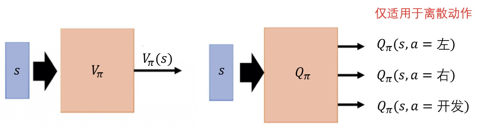

## PPO算法

